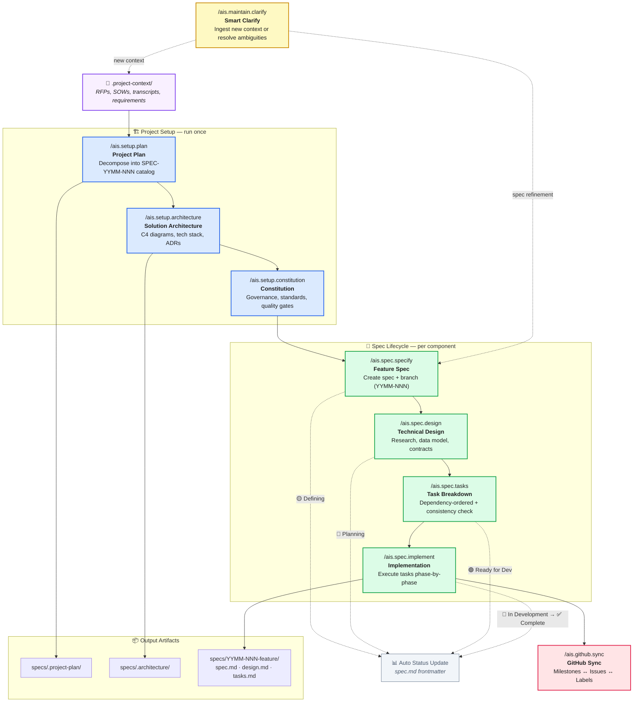

# AIS Workflow



## Phases at a Glance

| Phase | Commands | Key Output |
|-------|----------|------------|
| **Setup** | `plan` → `architecture` → `constitution` | Project plan, C4 architecture, governance standards |
| **Spec Lifecycle** | `specify` → `design` → `tasks` → `implement` | Feature spec, technical design, task list, working code |
| **Sync** | `github.sync` | GitHub milestones, issues, and labels |
| **Maintain** | `clarify` | Updated context or refined specs |

## Status Progression

Each spec lifecycle command automatically updates the project plan status tracker:

```
🟡 Defining  →  🔵 Planning  →  🟢 Ready for Dev  →  🚀 In Development  →  ✅ Complete
```
