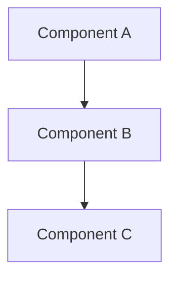

# Playbook: [ENGAGEMENT TYPE]

> **Version**: 1.0 | **Last Updated**: YYYY-MM-DD

## Overview

**What this project type involves**: [1-2 paragraphs describing the domain]

**Typical client profile**: [Who commissions this type of work]

**What success looks like**: [Measurable outcomes that define a successful engagement]

---

## Discovery Questions

Questions to ask during pre-sales and early discovery, organized by theme. Each notes which phase benefits most.

### Business

| # | Question | Phase |
|---|----------|-------|
| 1 | [Question about business goals] | Pre-sales |
| 2 | [Question about stakeholders] | Pre-sales |

### Technical

| # | Question | Phase |
|---|----------|-------|
| 1 | [Question about existing systems] | Pre-sales / Setup |
| 2 | [Question about constraints] | Setup |

### Data

| # | Question | Phase |
|---|----------|-------|
| 1 | [Question about data sources] | Pre-sales |
| 2 | [Question about data quality] | Setup |

### Operations

| # | Question | Phase |
|---|----------|-------|
| 1 | [Question about deployment] | Setup |
| 2 | [Question about monitoring] | Design |

---

## Governing Questions Register

> These questions must be answered before their tagged phase begins.
> When using AIS spec commands with an active playbook, unanswered questions
> for the current phase will be surfaced as soft-gate blockers.
>
> **How this works**: The playbook defines questions here. When a project
> selects this playbook (`specs/.discovery/playbook.md`), AIS commands create
> a tracker (`specs/.discovery/governing-questions.md`) from this register
> and check it at each phase boundary. Questions asked but not yet answered
> block the phase with a warning (not a hard block).
>
> **ID format**: GQ-NNN, numbered sequentially across all phases.
> **Domains**: Group questions by topic area (Business, Technical, Network,
> Data, Operations, etc.) — use domains relevant to this playbook.

### Pre-sales Phase

| ID | Domain | Question | Drives |
|----|--------|----------|--------|
| GQ-001 | [Domain] | [Question that must be answered before proposal] | [Design decision this answer drives] |

### Setup Phase

| ID | Domain | Question | Drives |
|----|--------|----------|--------|
| GQ-0XX | [Domain] | [Question that must be answered during kickoff] | [Design decision this answer drives] |

### Design Phase

| ID | Domain | Question | Drives |
|----|--------|----------|--------|
| GQ-0XX | [Domain] | [Question answered per-spec during design] | [Design decision this answer drives] |

---

## Typical Architecture Patterns

### Pattern: [NAME]

> **Driven by**: GQ-NNN ([question summary]), GQ-NNN ([question summary])

**When to use**: [Conditions where this pattern applies]

**Components**: [List of components]

**Trade-offs**: [Pros and cons]

### Pattern: [NAME 2]

**When to use**: [Conditions]

**Components**: [List]

**Trade-offs**: [Pros and cons]

---

## Common Spec Decomposition

Typical specs for this engagement type. Use as a starting point for proposed specs.

| Area | Spec Scope | Effort Range | Frequency |
|------|-----------|--------------|-----------|
| [Area 1] | [What it covers] | S-M | Always |
| [Area 2] | [What it covers] | M-L | Often |
| [Area 3] | [What it covers] | S | Sometimes |

---

## Estimation Patterns

> Playbooks own project-type-specific sizing guidance. Framework-wide proposal,
> SOW, green-sheet, external commercial-review, and commitment rules live in the
> pre-sales prompts and docs.

### Engagement Shape

| Shape | When to Use | Typical Team | Delivery Rhythm | Notes |
|-------|-------------|--------------|-----------------|-------|
| [Sprint-based team] | [Conditions] | [Roles] | [Sprint length / cadence] | [Phase-in/phase-out guidance] |
| [Milestone-based delivery] | [Conditions] | [Roles] | [Milestones/waves] | [Staffing considerations] |

### Effort Drivers

- [Factor that increases effort] — [how it impacts]
- [Factor that decreases effort] — [how it impacts]

### ROM Ranges by Complexity

| Complexity | Typical Range | Key Indicators |
|-----------|--------------|----------------|
| Simple | [range] | [indicators] |
| Moderate | [range] | [indicators] |
| Complex | [range] | [indicators] |

### Common Multipliers

- [Multiplier] — [when to apply, typical factor]

### Staffing and Green-Sheet Guidance

| Role / Discipline | When Needed | Typical Allocation | Sizing Driver |
|-------------------|-------------|--------------------|---------------|
| [Role] | [Phase/sprint/milestone] | [100% / 50% / 20% / 10% / Unknown] | [Which scope driver changes the allocation] |

### Role Library

Use this table to seed proposal/SOW staffing inputs. Keep it role- and
allocation-focused; do not include rates or prices.

| Role | Typical Responsibilities | Often Needed When | AI/Coding-Agent Assumption |
|------|--------------------------|-------------------|----------------------------|
| [Role] | [What this role owns] | [Project condition] | [Client permits / client restricts / TBD] |

### Non-Labor Cost Drivers

- Azure/platform consumption — [what drives usage and how to qualify it]
- Language-model/token usage — [model hosting, usage, evals, or chargeback drivers]
- Third-party services — [licenses, data, monitoring, or integration cost drivers]
- Customer operating cost model — [when this engagement should include a separate cost-modeling activity]

---

## Risk Patterns

Domain-specific risks with mitigations.

| # | Risk | Likelihood | Impact | Mitigation |
|---|------|-----------|--------|------------|
| 1 | [Risk description] | Medium | High | [Mitigation approach] |
| 2 | [Risk description] | Low | High | [Mitigation approach] |

---

## Tech Stack Recommendations

| Layer | Default | Alternatives | Notes |
|-------|---------|-------------|-------|
| [Layer 1] | [Default choice] | [Alt 1], [Alt 2] | [When to deviate] |
| [Layer 2] | [Default choice] | [Alt 1], [Alt 2] | [When to deviate] |

---

## Quality Gates

Domain-specific gates to seed the constitution.

| Gate | Category | Criteria | Severity |
|------|----------|----------|----------|
| [Gate 1] | [Category] | [Pass criteria] | MUST |
| [Gate 2] | [Category] | [Pass criteria] | SHOULD |

---

## Deliverable Checklist

### Pre-Sales Phase

- [ ] [Deliverable 1]
- [ ] [Deliverable 2]

### Kickoff Phase

- [ ] [Deliverable 1]
- [ ] [Deliverable 2]

### Per-Spec Phase

- [ ] [Deliverable 1]
- [ ] [Deliverable 2]

### Closeout Phase

- [ ] [Deliverable 1]
- [ ] [Deliverable 2]

---

## Anti-Patterns

Things to watch for and avoid in this engagement type.

| Anti-Pattern | Why It's Bad | What to Do Instead |
|-------------|-------------|-------------------|
| [Anti-pattern 1] | [Consequence] | [Better approach] |
| [Anti-pattern 2] | [Consequence] | [Better approach] |
