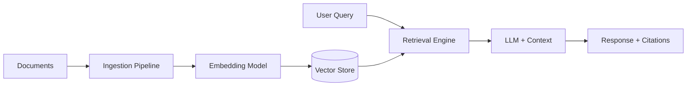
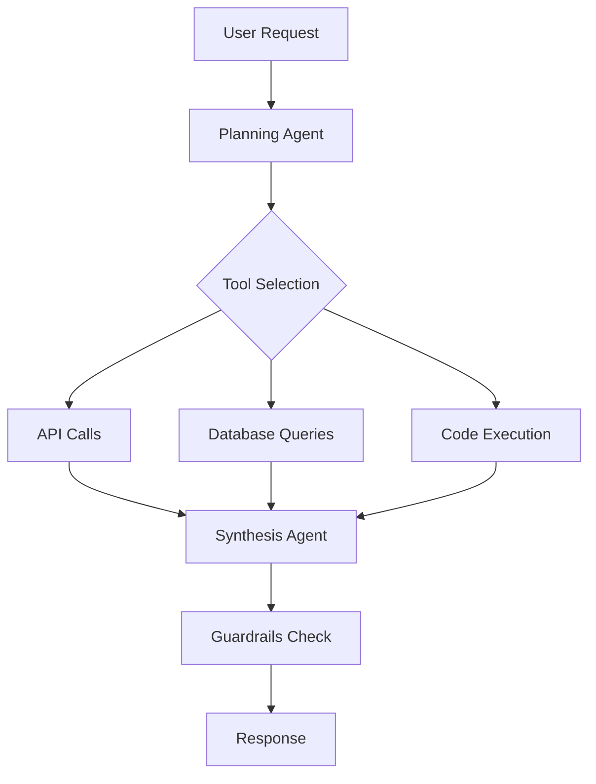

# Playbook: Agent & AI Builds

> **Version**: 1.0 | **Last Updated**: 2026-03-11

## Overview

**What this project type involves**: Building AI-powered systems — conversational agents, copilots, RAG pipelines, agentic workflows, ML model serving, and intelligent automation. These projects combine traditional application development with AI/ML infrastructure: model selection, prompt engineering, retrieval systems, evaluation frameworks, and guardrails. The stack typically includes an LLM provider, an orchestration layer, a vector store or knowledge base, and a user-facing interface.

**Typical client profile**: Organizations that want to augment their workflows with AI capabilities — customer service automation, internal knowledge assistants, document processing, code generation tools, or domain-specific copilots. Clients range from AI-curious (need education) to AI-mature (have existing ML infrastructure).

**What success looks like**: The AI system reliably handles its target use cases with measurable quality (accuracy, latency, user satisfaction), operates within cost constraints, degrades gracefully when uncertain, and has clear evaluation and improvement loops.

---

## Discovery Questions

### Business

| # | Question | Phase |
|---|----------|-------|
| 1 | What specific tasks or workflows should the AI handle? What does a human do today? | Pre-sales |
| 2 | How will you measure success? (accuracy, time saved, cost reduction, user adoption) | Pre-sales |
| 3 | What happens when the AI gets it wrong? What's the blast radius of errors? | Pre-sales |
| 4 | Who are the end users? How technical are they? | Pre-sales |
| 5 | Is there an existing manual process we're augmenting or replacing? | Pre-sales |

### Technical

| # | Question | Phase |
|---|----------|-------|
| 1 | Do you have existing AI/ML infrastructure? (model hosting, vector DB, eval tooling) | Pre-sales |
| 2 | Are there constraints on model providers? (data residency, compliance, cost caps) | Pre-sales / Setup |
| 3 | What's the expected latency budget? (real-time conversation vs. batch processing) | Setup |
| 4 | What authentication/authorization is needed for the AI's actions? | Setup |
| 5 | Are there existing APIs or systems the AI needs to interact with? | Pre-sales |

### Data

| # | Question | Phase |
|---|----------|-------|
| 1 | What knowledge sources will the AI use? (documents, databases, APIs, wikis) | Pre-sales |
| 2 | How often does the knowledge change? (static corpus vs. live data) | Pre-sales |
| 3 | What's the volume? (document count, total size, query frequency) | Setup |
| 4 | Are there data sensitivity or PII concerns in the knowledge base? | Pre-sales |
| 5 | Do you have labeled examples or ground truth for evaluation? | Setup |

### Operations

| # | Question | Phase |
|---|----------|-------|
| 1 | What's the expected query volume? (concurrent users, queries per day) | Setup |
| 2 | How will you monitor AI quality in production? (human review, automated eval) | Design |
| 3 | What's the plan for prompt/model updates? (versioning, rollback, A/B testing) | Design |
| 4 | What guardrails are needed? (content filtering, scope limits, escalation to human) | Setup |

---

## Typical Architecture Patterns

### Pattern: RAG (Retrieval-Augmented Generation)

**When to use**: AI needs to answer questions from a knowledge base (documents, wikis, manuals, databases). Most common pattern for enterprise AI.

**Components**: Document ingestion pipeline, embedding model, vector store, retrieval engine, LLM, response generation, citation tracking

**Trade-offs**: Excellent for factual Q&A; struggles with multi-hop reasoning across many documents. Quality depends heavily on chunking strategy and retrieval relevance.

### Pattern: Agentic Workflow

**When to use**: AI needs to take actions, use tools, or orchestrate multi-step processes. Goes beyond Q&A into task completion.

**Components**: Orchestration framework, tool definitions, state management, guardrails, approval gates, audit logging

**Trade-offs**: Powerful for complex tasks; harder to evaluate and test. Requires careful guardrails to prevent unintended actions. Cost per interaction is higher.

### Pattern: Conversational Agent with Memory

**When to use**: Multi-turn conversations that need context retention (customer support, coaching, tutoring).

**Components**: Conversation manager, short-term memory (session), long-term memory (user profile), intent detection, response generation, escalation logic

**Trade-offs**: Natural user experience; complexity in managing context windows and memory persistence. Session cost grows with conversation length.

---

## Common Spec Decomposition

| Area | Spec Scope | Effort Range | Frequency |
|------|-----------|--------------|-----------|
| Knowledge Ingestion Pipeline | Document parsing, chunking, embedding, vector store population | M-L | Always (for RAG) |
| Core AI Service | LLM integration, prompt templates, response generation, streaming | M | Always |
| Retrieval Engine | Vector search, hybrid search, re-ranking, citation tracking | M | Always (for RAG) |
| Tool/Action Framework | Tool definitions, execution engine, approval gates, audit logging | M-L | Often (for agents) |
| Conversation Management | Session handling, memory, context windowing, multi-turn flow | S-M | Often |
| Evaluation Framework | Test suites, metrics collection, ground truth comparison, regression detection | M | Always |
| Guardrails & Safety | Content filtering, scope enforcement, PII redaction, escalation to human | S-M | Always |
| User Interface | Chat UI, streaming responses, feedback collection, conversation history | M | Often |
| Admin & Monitoring | Usage dashboards, cost tracking, quality metrics, prompt versioning | S-M | Often |
| Auth & Multi-tenancy | User auth, tenant isolation, data access scoping per user/role | S-M | Sometimes |

---

## Estimation Patterns

### Effort Drivers

- **Knowledge base complexity** — More document types, larger corpus, and frequent updates increase ingestion pipeline effort
- **Action surface area** — More tools/APIs the agent can use means more integration, testing, and guardrail work
- **Evaluation rigor** — Regulated industries or high-stakes decisions require more thorough eval frameworks
- **Multi-tenancy** — Tenant isolation for knowledge bases and conversations adds significant complexity
- **Real-time vs. batch** — Streaming responses and low-latency requirements add infrastructure complexity

### ROM Ranges by Complexity

| Complexity | Typical Range | Key Indicators |
|-----------|--------------|----------------|
| Simple | 200-400 hours | Single knowledge source, Q&A only, one user type, no tool use |
| Moderate | 400-800 hours | Multiple sources, some tool use, eval framework, basic guardrails |
| Complex | 800-1500 hours | Multi-agent orchestration, many integrations, custom eval, multi-tenant, compliance requirements |

### Common Multipliers

- **Compliance/regulatory** — 1.3-1.5x for healthcare, finance, legal domains (audit trails, data handling)
- **Multi-language support** — 1.2-1.4x per additional language for prompt engineering and evaluation
- **Custom model fine-tuning** — 1.5-2x if using fine-tuned models vs. off-the-shelf with prompting

---

## Risk Patterns

| # | Risk | Likelihood | Impact | Mitigation |
|---|------|-----------|--------|------------|
| 1 | AI hallucination in production — generates confident but incorrect answers | High | High | Implement citation tracking, confidence scoring, and fallback to "I don't know". Build eval suite with known-answer tests. |
| 2 | Prompt injection — users craft inputs that bypass guardrails or leak system prompts | Medium | High | Layer input validation, output filtering, and system prompt protection. Separate user context from system instructions. |
| 3 | Cost overrun — LLM API costs exceed budget as usage scales | Medium | Medium | Implement token budgets, caching, model tiering (small model for simple queries, large for complex), and usage monitoring with alerts. |
| 4 | Knowledge staleness — vector store drifts from source truth | Medium | Medium | Build automated refresh pipeline with change detection. Monitor retrieval quality metrics over time. |
| 5 | Scope creep into general AI — "can it also do X?" requests expand beyond original use case | High | Medium | Define clear AI scope boundaries in spec. Document what the AI explicitly does NOT do. Evaluate new capabilities as separate specs. |
| 6 | Evaluation gap — no ground truth data to measure quality | Medium | High | Start with human evaluation protocol. Build golden dataset iteratively. Use LLM-as-judge for scaling eval. |
| 7 | Latency exceeding user expectations for real-time use cases | Medium | Medium | Set latency budgets per interaction type. Use streaming responses. Pre-compute common queries. |

---

## Tech Stack Recommendations

| Layer | Default | Alternatives | Notes |
|-------|---------|-------------|-------|
| LLM Provider | Anthropic Claude (API) | OpenAI GPT-4, Azure OpenAI, AWS Bedrock, Google Vertex AI | Match to client's cloud provider and compliance needs |
| Orchestration | LangGraph, Claude Agent SDK | LangChain, Semantic Kernel, custom | LangGraph for complex agents; SDK for simpler flows |
| Vector Store | Pinecone | Weaviate, Qdrant, pgvector, Azure AI Search, ChromaDB | pgvector if already on PostgreSQL; managed services reduce ops |
| Embedding Model | OpenAI text-embedding-3 | Cohere Embed, Voyage AI, open-source (BGE, E5) | Open-source for cost-sensitive or on-prem |
| Document Processing | Unstructured.io | LlamaIndex parsers, Apache Tika, custom | Unstructured for heterogeneous document types |
| Evaluation | Custom + Braintrust | LangSmith, Promptfoo, Ragas | Build custom metrics; use platform for tracking |
| Frontend | Next.js + Vercel AI SDK | Streamlit (prototyping), custom React | Vercel AI SDK has excellent streaming support |
| Observability | LangSmith / Braintrust | Helicone, custom logging | Essential for debugging and quality monitoring |

---

## Quality Gates

| Gate | Category | Criteria | Severity |
|------|----------|----------|----------|
| Retrieval Relevance | AI Quality | Top-5 retrieval precision ≥ 80% on eval dataset | MUST |
| Answer Accuracy | AI Quality | Factual accuracy ≥ 90% on golden dataset (human-evaluated) | MUST |
| Hallucination Rate | AI Quality | < 5% of responses contain fabricated information | MUST |
| Guardrail Coverage | Safety | All user-facing prompts have input/output filtering | MUST |
| Citation Accuracy | AI Quality | ≥ 95% of cited sources are real and relevant | SHOULD |
| Latency P95 | Performance | < 3s for first token, < 15s for complete response | SHOULD |
| Cost Per Query | Operations | Within defined budget per interaction tier | SHOULD |
| Eval Suite Coverage | Testing | ≥ 50 test cases covering core use cases and edge cases | MUST |

---

## Deliverable Checklist

### Pre-Sales Phase

- [ ] AI use case definition with success metrics
- [ ] Knowledge source inventory and access feasibility
- [ ] Model provider recommendation with cost estimate
- [ ] ROM with complexity drivers identified

### Kickoff Phase

- [ ] Evaluation framework design (metrics, golden dataset plan, human eval protocol)
- [ ] Knowledge ingestion pipeline architecture
- [ ] Guardrail strategy document
- [ ] Development environment with LLM access configured

### Per-Spec Phase

- [ ] Working feature with passing eval suite
- [ ] Updated golden dataset with new test cases
- [ ] Cost analysis for the feature's LLM usage
- [ ] Guardrail validation results

### Closeout Phase

- [ ] Production deployment with monitoring
- [ ] Operations runbook (cost monitoring, quality alerts, model updates)
- [ ] Knowledge refresh automation verified
- [ ] Handoff documentation for ongoing prompt/model maintenance

---

## Anti-Patterns

| Anti-Pattern | Why It's Bad | What to Do Instead |
|-------------|-------------|-------------------|
| Building without eval | No way to measure quality, detect regressions, or compare approaches | Build evaluation framework in the first spec, before any feature work |
| Treating prompts as code | Prompts are fragile — small changes have unpredictable effects across use cases | Version prompts, test against eval suite, use prompt templates with typed variables |
| One giant system prompt | Bloated prompts degrade quality and increase cost | Compose smaller, focused prompts per task; use tool descriptions for capabilities |
| Skipping guardrails for MVP | "We'll add safety later" — but production users find exploits immediately | Implement basic input/output filtering from day one; iterate on sophistication |
| Over-indexing on model choice | Spending weeks evaluating models instead of building | Pick a strong default (Claude/GPT-4), build the system, swap models if eval shows need |
| Ignoring cost at design time | Per-query costs compound — a chatty agent with tool loops can cost $1+ per interaction | Set token budgets, implement caching, use model tiering from the start |
| RAG without chunking strategy | Default chunking produces poor retrieval — too large loses precision, too small loses context | Design chunking around document structure; test retrieval quality with real queries |
