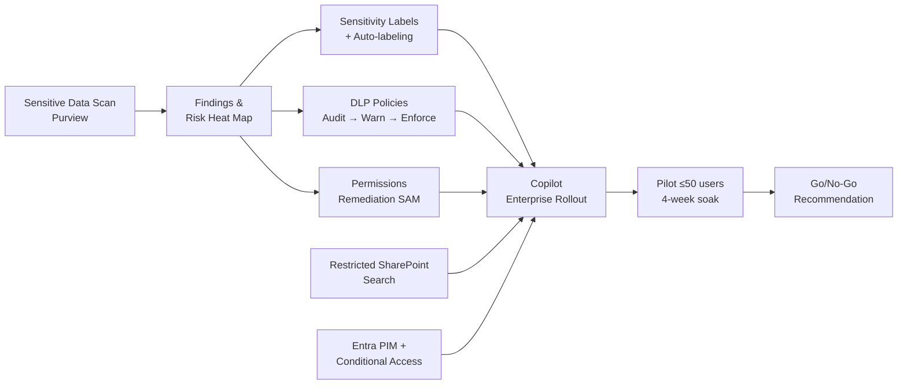
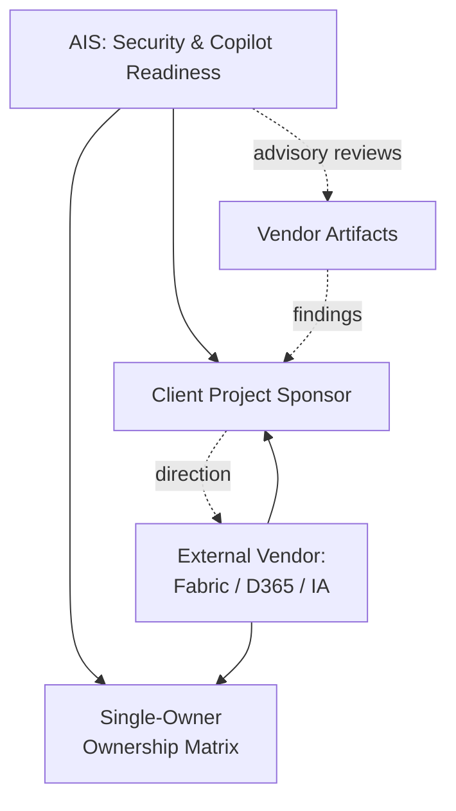

# Playbook: Microsoft 365 Copilot Readiness

> **Version**: 1.0 | **Last Updated**: 2026-04-22

## Overview

**What this project type involves**: Preparing a Microsoft 365 tenant for enterprise rollout of Microsoft 365 Copilot by establishing the security, compliance, and governance foundation Copilot requires to operate safely. Unlike "Agent & AI Builds" engagements (which *build* AI systems), Copilot Readiness engagements *enable* a Microsoft-delivered AI product by closing data-security gaps, normalizing permissions, activating Purview controls, and standing up the AI governance, change-management, and adoption plumbing. Work is sequenced as Assess → Design → Implement → Pilot → Go/No-Go, typically inside a 14–18 week window that leverages Microsoft funding programs (Data Security Assessment, Copilot Adoption Accelerator, Deployment Vouchers).

**Typical client profile**: Mid-market to enterprise organizations (roughly 500–5,000 employees) with Microsoft 365 E3/E5 and Copilot licenses either purchased or imminently purchased. Often co-delivered alongside a separate data/modernization vendor (e.g., Fabric, D365, AEC360) where AIS owns the security and Copilot readiness lane and provides advisory oversight to the other vendor. Stakeholders usually include a CISO/CIO sponsor, an IT/M365 admin team, a communications/change lead, and a cross-functional AI steering group being stood up for the first time.

**What success looks like**: A defensible, documented Copilot launch: sensitive data is identified and labeled on the highest-risk content, DLP is staged (audit → warn → enforce) on the most sensitive data flows, high-risk sites are remediated, Restricted SharePoint Search (RSS) bounds Copilot's reach, Entra PIM protects privileged roles, a piloted cohort of real users validates the experience, and a formal Go/No-Go recommendation with runbooks and a maturity roadmap hands the capability off to the client's ops team.

---

## Discovery Questions

Questions to ask during pre-sales and early discovery, organized by theme.

### Business

| # | Question | Phase |
|---|----------|-------|
| 1 | What is the target enterprise rollout date for Copilot, and what drives it (license renewal, leadership commitment, event)? | Pre-sales |
| 2 | Who is the executive sponsor and who owns the Go/No-Go decision? | Pre-sales |
| 3 | What are the top 3–5 Copilot use cases by persona that leadership expects to see value from first? | Pre-sales |
| 4 | What does "enterprise rollout" mean here — all eligible users at once, or wave-based? | Pre-sales |
| 5 | Is there a separate AI/modernization vendor in the picture (Fabric, D365, etc.) and what is AIS's role relative to them? | Pre-sales |
| 6 | Are there Microsoft funding programs (DSA, Adoption Accelerator, Deployment Vouchers) in play, and who is the Microsoft account team contact? | Pre-sales |

### Technical

| # | Question | Phase |
|---|----------|-------|
| 1 | Are E5 and Copilot licenses active today? If not, when will they be procured? | Pre-sales / Setup |
| 2 | What's the current M365 Secure Score, and is there a baseline established? | Setup |
| 3 | What is the state of Purview today — deployed, partially configured, or greenfield? | Pre-sales / Setup |
| 4 | Is SharePoint Advanced Management (SAM) available in the tenant? | Setup |
| 5 | Is Entra PIM in use for privileged roles? Are there standing Global Admin accounts? | Setup |
| 6 | What is the Conditional Access posture, and are there guest accounts / external sharing risks? | Setup |
| 7 | What access model will AIS operate under — least-privilege with time-bound PIM elevation? | Setup |

### Data

| # | Question | Phase |
|---|----------|-------|
| 1 | Where does the most sensitive data live today (SharePoint, OneDrive, Exchange, Teams, Azure Files, on-prem file shares)? | Pre-sales |
| 2 | Are there known oversharing or "everyone / all company" permissions patterns on high-risk sites? | Pre-sales / Setup |
| 3 | Are there existing sensitivity labels or DLP policies? What's their coverage and enforcement state? | Setup |
| 4 | Is Azure Files / AFS in scope for Copilot accessibility now, later, or never? | Pre-sales |
| 5 | What regulated data categories exist (PII, PHI, PCI, client-confidential, ITAR)? | Pre-sales |
| 6 | What is the Teams / M365 Groups sprawl situation — inventory, orphaned teams, guest access? | Setup |

### Operations

| # | Question | Phase |
|---|----------|-------|
| 1 | Who will operate the controls after handoff, and what is their capacity? | Setup |
| 2 | What pilot cohort structure exists or can be borrowed (e.g., existing change cohorts)? | Setup |
| 3 | What is the communications / change management capability in place? | Setup |
| 4 | How will Copilot quality and adoption be monitored post-launch (Copilot Analytics, Purview Audit)? | Design |
| 5 | What is the expected ongoing managed services model (in-house, AIS MSP, hybrid)? | Design |

---

## Governing Questions Register

> These questions must be answered before their tagged phase begins. When this playbook is selected, AIS commands create a tracker (`specs/.discovery/governing-questions.md`) and soft-gate each phase boundary on them.

### Pre-sales Phase

| ID | Domain | Question | Drives |
|----|--------|----------|--------|
| GQ-001 | Business | What is the target Copilot enterprise rollout date and what drives it? | Period of performance, pilot timing, Phase 1 gate date |
| GQ-002 | Business | Which Microsoft funding programs (DSA, Adoption Accelerator, Deployment Vouchers) are in play and what is the Microsoft account team alignment? | Pricing net-of-funding, CSI survey sequencing, DSA timing |
| GQ-003 | Co-delivery | Is a separate data/modernization vendor (Fabric, D365, AEC360) in scope, and what is the ownership boundary? | Whether an HSO-style oversight/advisory deliverable (D12 analog) is required |
| GQ-004 | Licensing | Are E5 and Copilot licenses active or procured? If not, when? | Sequencing of Purview/SAM/PIM work vs. Phase 1 Week 3 threshold |
| GQ-005 | Business | Who is the executive sponsor with written decision authority? | Named approver for phase gates, Implementation Plan approval, Go/No-Go |

### Setup Phase

| ID | Domain | Question | Drives |
|----|--------|----------|--------|
| GQ-010 | Access | What least-privileged access model will AIS operate under (Global Reader + targeted admin via PIM)? | Phase 0 access provisioning, paired-config procedure |
| GQ-011 | Data | What data sources are in scope for the sensitive data scan (SharePoint, OneDrive, Exchange, Teams, AFS visibility)? | Scan configuration, Purview connector setup |
| GQ-012 | Data | Is AFS in scope for Copilot accessibility now, later (roadmap), or never? | Boundary decision documented in D4/D7 user-facing summary |
| GQ-013 | Pilot | What cohort structure will the pilot use, and who are the 2–3 Copilot champions? | D10 pilot design, training plan, success metrics |
| GQ-014 | Governance | Does an AI Steering Group exist, or does this engagement stand one up? | D6 AI Readiness Toolkit scope (charter + inaugural materials vs. alignment only) |
| GQ-015 | Change | Which user cohorts need differentiated messaging (AI-averse, attribution-risk, external-tool loyalists)? | D7 Change Management & Communications Playbook segmentation |

### Design Phase

| ID | Domain | Question | Drives |
|----|--------|----------|--------|
| GQ-020 | Data | What is the sensitivity label taxonomy, and what is the auto-labeling strategy for priority content? | D5 label design, D9 implementation scope |
| GQ-021 | Data | Which sensitive data flows require DLP, and what is the staging sequence (audit → warn → enforce)? | D5 DLP design, D9 number-of-policies commitment in D8 |
| GQ-022 | Data | Which sites are highest-risk and in scope for permissions remediation? | D8 Implementation Plan scope, D9 remediation effort |
| GQ-023 | Copilot | What is the Restricted SharePoint Search (RSS) configuration strategy? | D4 blueprint, D9 RSS enforcement |
| GQ-024 | AI Governance | What are the agent readiness guardrails (environment strategy, DLP connector policies, builder/consumer role split)? | D4/D6 guardrails; sets boundary for future agent work |
| GQ-025 | Go/No-Go | What are the Phase 1 Copilot Definition of Done criteria and Go/No-Go success metrics? | D4 blueprint, D10 recommendation framework |

---

## Typical Architecture Patterns

### Pattern: Foundation-First Readiness (Default)

> **Driven by**: GQ-011 (data scope), GQ-020 (label taxonomy), GQ-021 (DLP staging), GQ-023 (RSS)

**When to use**: Default pattern for every Copilot Readiness engagement. The client has E5 + Copilot, needs a defensible launch before a target date, and wants foundational controls (labels, DLP, permissions, RSS) implemented before enterprise activation.

**Components**: Microsoft Purview (Info Protection, DLP, DSPM for AI), SharePoint Advanced Management, Restricted SharePoint Search, Entra PIM, Conditional Access, Copilot Analytics, M365 Groups lifecycle guardrails.

**Trade-offs**: Delivers a secure, auditable launch without waiting for every control to mature. Intentionally stages Adaptive Protection and Purview Audit Premium to the roadmap so the foundation is in place before automation layers are activated.

### Pattern: Co-Delivery with External Vendor Oversight

> **Driven by**: GQ-003 (co-delivery), single-owner ownership matrix

**When to use**: A separate vendor is delivering the data platform / modernization work (Fabric, D365, industry accelerators, broader transformation programs) in parallel. AIS owns the security and Copilot readiness lane and provides advisory reviews of the other vendor's artifacts.

**Components**: All Foundation-First components, plus an Oversight Package: design/acceptance reviews (capped hours), risk register, acceptance criteria framework, escalation triggers, coordination-through-client model.

**Trade-offs**: Prevents overlap and finger-pointing via a single-owner matrix per capability. Caps advisory hours (typical: 40) to avoid scope creep. Requires strict "findings route through the client, not vendor-to-vendor" discipline.

### Pattern: Phased-Gate Fixed-Price with Findings-Driven Implementation

> **Driven by**: GQ-001 (rollout date), moderate-complexity pricing assumption

**When to use**: When the implementation complexity cannot be precisely known at contract signing (permissions scope, DLP policy count, label depth are all findings-dependent). Phase 1 is fully committed; Phase 2 scope is pinned by an Implementation Plan (gating deliverable) that the client approves before Phase 2 work begins.

**Components**: Phase 1 (Assess & Design, ~7 weeks, fully committed), Phase 1 Gate (Implementation Plan approval), Phase 2 (Implement & Pilot, ~6 weeks, scoped by the Plan), Phase 2b (Operationalize & Handoff, ~3 weeks).

**Trade-offs**: Avoids mid-engagement change orders by pricing Phase 2 against actual findings. Requires a disciplined written-gate culture — the client must approve the Implementation Plan in writing before Phase 2 begins. If the plan materially exceeds moderate-complexity assumptions, scope adjustment or a Change Order is handled at the gate, not mid-flight.

---

## Common Spec Decomposition

Typical specs for this engagement type. Use as a starting point for proposed specs. Sizing assumes moderate complexity; scale for the client.

| Area | Spec Scope | Effort Range | Frequency |
|------|-----------|--------------|-----------|
| Data Security Assessment | Sensitive data scan (SPO/OneDrive/Exchange/Teams), AFS visibility, Insider Risk baseline, compliance gap analysis, risk-prioritized remediation roadmap | M-L | Always |
| Technical Readiness Assessment | Entra posture review, Secure Score baseline, SharePoint/Teams/OneDrive oversharing audit via SAM, Teams governance, Groups risk, licensing alignment | M | Always |
| Copilot Scenario Backlog & Scope | Executive "Art of the Possible", top-10 use-case backlog, Phase 1 scope definition, one-page user summary | S-M | Always |
| Copilot Deployment Blueprint | Wave deployment plan, admin configuration, starter prompt library, admin/support runbook, Definition of Done, Go/No-Go criteria framework, agent readiness guardrails | M-L | Always |
| Purview & Controls Design | Sensitivity label taxonomy, auto-labeling rules, DLP policy design with staging, AI DSPM configuration, maturity roadmap items (Adaptive Protection, Audit Premium) | M | Always |
| AI Readiness Toolkit | AI Steering Group charter, AI policies (usage, disclosure, responsible use), AI maturity assessment, certified data rules, AI intake process, agent readiness controls | S-M | Always |
| Change Management & Communications Playbook | Cohort-differentiated messaging, champion network design, 30/60/90-day adoption roadmap, one-page staff summary | S-M | Always |
| Phase 2 Implementation Plan (Gating) | Specific controls to implement, DLP/label/remediation counts, RSS plan, pilot design, scope adjustments if any | S | Always |
| Controls & Configurations Implementation | Sensitivity label + auto-labeling, DLP staged rollout, SAM activation, permissions normalization, Entra PIM, RSS, Groups lifecycle guardrails | L | Always |
| Pilot & Go/No-Go | ≤50-user pilot aligned to existing cohorts, 2 training sessions, 4-week adoption monitoring, retrospective with formal Go/No-Go | M | Always |
| Executive Readout & Handoff | Secure Score delta, runbooks for limited-staff operability, knowledge transfer, risk register, Phase 2 / MSP proposals, maturity roadmap | S-M | Always |
| External Vendor Oversight | Capped-hour advisory reviews (design + acceptance), risk register, acceptance criteria framework, escalation process | S-M | Often (co-delivery) |

---

## Estimation Patterns

### Effort Drivers

- **Employee count & tenant scale** — More users and sites = larger scan surface, more permissions to audit, more pilot coordination
- **Existing Purview / security maturity** — A partially configured Purview environment can *increase* effort (untangling existing policies) or *decrease* it (foundation already laid)
- **Permissions remediation scope** — Number of high-risk sites and the structural complexity of their permissions drive Phase 2 the most; this is the #1 moderate→complex swing factor
- **Number of DLP policies / sensitivity labels** — More regulated data categories → more labels, more auto-labeling rules, more DLP policies across more workloads
- **Azure Files / AFS involvement** — Visibility only (in scope) is bounded; connector enablement (out of scope) is a major lift
- **Co-delivery coordination** — Each additional vendor in the picture adds oversight hours and ownership-matrix complexity
- **Change management cohort count** — Differentiated messaging for 2 cohorts vs. 5 meaningfully changes D7 effort
- **AI Steering Group maturity** — Standing up a new AISG from zero is much heavier than aligning an existing one
- **Regulatory posture** — Regulated industries (healthcare, legal, gov, ITAR) increase policy-design rigor and documentation

### ROM Ranges by Complexity

| Complexity | Typical Range | Key Indicators |
|-----------|--------------|----------------|
| Simple | 10–13 weeks, $110K–$140K FFP | <500 users, Purview mostly configured, few regulated data categories, no co-delivery vendor, existing AISG |
| Moderate | 14–18 weeks, $150K–$200K FFP | 500–2,500 users, Purview partial, 2–4 regulated data categories, one co-delivery vendor, AISG to be stood up, pilot ≤50 |
| Complex | 18–24 weeks, $200K–$320K+ FFP | 2,500+ users, greenfield Purview or heavily customized, 5+ regulated categories, multi-vendor delivery, multi-geo/multi-tenant, heavy permissions remediation, regulated industry |

### Common Multipliers

- **Regulated industry (healthcare, finance, legal, gov)** — 1.2–1.4x on assessment and policy-design effort
- **Multi-tenant / multi-geo** — 1.3–1.6x on scan, label, and DLP work (policies often don't cleanly cross tenants)
- **Co-delivery with external vendor** — +40–80 advisory hours (capped, tracked separately)
- **Greenfield Purview** — 1.2–1.3x on D5 (more design-from-scratch)
- **Heavy oversharing backlog** — 1.3–1.5x on D9 permissions remediation (bounded by D8 scope)
- **Microsoft funding unavailable or reduced** — no effort impact but significant net-cost impact; surface early

---

## Risk Patterns

| # | Risk | Likelihood | Impact | Mitigation |
|---|------|-----------|--------|------------|
| 1 | Copilot exposes sensitive content on launch because sensitivity labels / DLP / permissions aren't in place first | High | High | Enforce the "visibility before controls, scan first" sequence. Do not activate Copilot for a user cohort until RSS, DLP (at least audit), and priority labels are live. Phase 1 Definition of Done gates activation. |
| 2 | License sequencing slips: E5 not active by Week 3 or Copilot not active by Phase 2 pilot | Medium | High | Make license procurement a written Phase 0 exit criterion. Notify in writing and toll timeline day-for-day if slipped. |
| 3 | Phase 1 findings materially exceed moderate-complexity pricing assumption | Medium | Medium | Use the D8 Implementation Plan as the explicit scope-alignment mechanism; surface deviations at the gate, not mid-Phase 2. Either adjust scope within budget or execute a Change Order before Phase 2. |
| 4 | Co-delivery vendor artifacts arrive late, compressing the review window | Medium | Medium | Contractually toll timeline day-for-day for late inputs. Cap advisory hours with 75% consumption notice. Route all findings through the client, never vendor-to-vendor. |
| 5 | Over-broad "Global Admin for AIS" access request normalized during project | Medium | Medium | Operate under least-privileged access (1–2 accounts, Global Reader + targeted admin roles via PIM, paired configuration). Zero standing Global Admin. |
| 6 | AI Steering Group never actually meets or makes decisions, so governance exists on paper only | Medium | Medium | Deliver not just a charter but inaugural meeting materials, a decision log template, and a lightweight AI intake process. Schedule the first meeting before Phase 2 ends. |
| 7 | Users misuse Copilot output (attribution, hallucination trust) | Medium | Medium | Cohort-differentiated messaging in D7 specifically addresses attribution-risk users. Include disclosure statement and usage policy in D6. Monitor via Copilot Analytics. |
| 8 | DLP policies enforced too aggressively, creating user friction and rollback pressure | Medium | Medium | Stage every DLP policy audit → warn → enforce with soak time between stages. Build an exception process before enforce. |
| 9 | Pilot cohort isn't representative, leading to a Go/No-Go decision that doesn't hold at enterprise scale | Low | High | Anchor pilot cohorts to existing change structures or transformation cohorts. Include multiple personas. 4-week active monitoring minimum. |
| 10 | Scope creep from "can Copilot also do agents / Copilot Studio / AFS connector?" | High | Medium | Maintain explicit out-of-scope section. Agent readiness is guardrails only, not build. AFS is visibility, not connector enablement. Use Change Orders, not verbal yeses. |
| 11 | Adaptive Protection or Audit Premium gets pushed into Phase 2 by stakeholder pressure despite roadmap placement | Medium | Medium | Keep these explicitly "assessed and roadmapped" in D5. Educate sponsor that they require the foundation to exist first. |
| 12 | Handoff fails because runbooks assume more operator depth than the client team has | Medium | High | Build runbooks for limited-staff operability from day one. Validate with the actual handoff team before closeout. Quantify ops capacity early (GQ). |

---

## Tech Stack Recommendations

Copilot Readiness is almost entirely a Microsoft-stack engagement. "Alternatives" here means "how the capability is delivered" rather than competing products.

| Layer | Default | Alternatives | Notes |
|-------|---------|-------------|-------|
| Data Classification & Labeling | Microsoft Purview Information Protection | Third-party (AIP-compatible) | Purview-native unless client has an existing classification investment |
| DLP | Microsoft Purview DLP (Exchange, SPO, OneDrive, Teams, Endpoint) | — | Always staged audit → warn → enforce |
| AI Data Security | Purview AI DSPM for Copilot | — | E5 entitlement; configure at design, monitor at pilot |
| Oversharing / Permissions | SharePoint Advanced Management (SAM) | Manual PowerShell audits | SAM is strongly preferred where available |
| Copilot Search Boundary | Restricted SharePoint Search (RSS) | — | Use during pilot and early enterprise rollout; relax as permissions mature |
| Identity & Access | Entra ID, Entra PIM, Conditional Access | — | Time-bound elevation; zero standing Global Admin for consultants |
| Insider Risk | Microsoft Purview Insider Risk Management | — | Baseline in Phase 1; Adaptive Protection on the roadmap |
| Auditing | Purview Audit Standard | Purview Audit Premium (roadmap) | Premium recommended after foundation is live |
| Copilot Governance | Copilot admin center, Copilot Analytics | — | Persona targeting, plugin governance, analytics dashboards |
| Agent Governance (readiness) | Power Platform environment strategy, DLP connector policies, builder/consumer roles | — | Readiness guardrails only; agent build is out of scope |
| Change Management | Internal comms tools + champion network | Third-party adoption platform (e.g., WalkMe) | Cohort-segmented messaging is the differentiator, not tooling |
| Program Management | Weekly technical sync + bi-weekly executive status + phase gates | — | "Wins and impact" section in executive status; written gate decisions |
| Documentation / Runbooks | Markdown in client's M365 (SharePoint/Loop) | Confluence, Word | Where the client will actually operate from after handoff |

---

## Quality Gates

Domain-specific gates to seed the constitution.

| Gate | Category | Criteria | Severity |
|------|----------|----------|----------|
| Least-Privileged Access | Security | AIS operates with zero standing Global Admin; all privileged work paired-config + PIM time-bound | MUST |
| Written Phase Gates | Governance | Phase 0 exit, D8 approval, blueprint approval, AFS boundary, pilot cohort, Go/No-Go all confirmed in writing by project sponsor | MUST |
| DLP Staging Discipline | Security | Every DLP policy goes audit → warn → enforce with documented soak time; no direct-to-enforce | MUST |
| Sensitive Data Visibility Before Controls | Security | No label/DLP/permissions control is designed before the sensitive data scan results are reviewed | MUST |
| Copilot Definition of Done | Governance | A documented DoD (controls + procedures + enablement artifacts) exists and is met before each cohort activation | MUST |
| Restricted SharePoint Search Enabled | Security | RSS enforced for the pilot and early enterprise rollout; relaxation is a documented decision | MUST |
| Runbook Operability | Handoff | Runbooks are validated with the actual handoff team and rated operable with the staff available | MUST |
| Microsoft Funding Reconciliation | Commercial | All Microsoft funding claims (DSA, Accelerator, Vouchers) are documented and reconciled before final invoice | SHOULD |
| Co-Delivery Single Owner | Governance | Every overlap capability has exactly one owner in the AIS vs. external-vendor matrix; the client is the decision authority | MUST (when co-delivery applies) |
| Advisory Hour Cap Notice | Commercial | 75% consumption notice for any capped advisory workstream (e.g., external vendor oversight) | MUST (when co-delivery applies) |
| Pilot Representativeness | Quality | Pilot cohort aligns to existing change structures and covers multiple personas; 4-week minimum active monitoring | MUST |
| AI Steering Group Operating | Governance | AISG has a charter, inaugural meeting completed, and a decision log before closeout | SHOULD |
| Secure Score Delta | Measurable Outcome | Baseline captured; closing delta reported in D11 | MUST |

---

## Deliverable Checklist

### Pre-Sales Phase

- [ ] Target rollout date and sponsor confirmed
- [ ] Microsoft funding alignment (DSA, Accelerator, Vouchers) with account team
- [ ] License state confirmed (E5, Copilot) or procurement plan with dates
- [ ] Co-delivery vendor boundary understood (ownership matrix draft)
- [ ] ROM with moderate/complex indicators called out
- [ ] Proposal with phased-gate fixed-price structure

### Kickoff Phase (Phase 0 → Phase 1 Week 1)

- [ ] Project sponsor + technical POC designated in writing
- [ ] Least-privileged access provisioned; PIM configured; paired-config procedure documented
- [ ] Microsoft CSI surveys completed; DSA initiated if applicable
- [ ] Stakeholder interview schedule (up to ~10 × 45-min) locked
- [ ] Pilot cohort and champions identified
- [ ] AIS vs. external-vendor ownership matrix draft circulated
- [ ] AI Steering Group composition agreed (or stand-up plan)

### Per-Spec Phase

- [ ] Spec drafted per the 12-deliverable decomposition (or subset)
- [ ] Governing questions for the spec's phase all answered
- [ ] Design reviewed against constitution gates
- [ ] Implementation linked to Phase 2 Implementation Plan line items (where applicable)
- [ ] Operational validation defined (for D9/D10 specs)

### Phase Gates

- [ ] **Phase 0 Exit**: Access, licenses, stakeholders, sponsor, ownership matrix draft — all confirmed in writing
- [ ] **Phase 1 Gate**: D8 Implementation Plan approved in writing by sponsor before Phase 2 begins
- [ ] **Blueprint Approval**: D4 signed off before controls are implemented
- [ ] **AFS Boundary**: Written decision on what Copilot can/cannot access
- [ ] **Pilot Go/No-Go**: Formal recommendation delivered; enterprise rollout decision logged

### Closeout Phase

- [ ] D9 controls validated within agreed window
- [ ] D10 pilot retrospective + formal Go/No-Go recommendation delivered
- [ ] D11 executive readout: wins/impact, Secure Score delta, risk register, open items, maturity roadmap
- [ ] Runbooks validated with handoff team
- [ ] Microsoft funding claims reconciled
- [ ] Phase 2 / MSP proposals presented alongside D11 (informational only unless contracted)
- [ ] External-vendor oversight package closed with final advisory hours reported

---

## Anti-Patterns

Things to watch for and avoid in this engagement type.

| Anti-Pattern | Why It's Bad | What to Do Instead |
|-------------|-------------|-------------------|
| Activating Copilot before RSS + priority labels + DLP audit are live | Copilot surfaces oversharing instantly; one embarrassing query can trigger a rollback and kill executive confidence | Gate every activation on the Phase 1 Copilot Definition of Done. RSS on. Priority labels live. DLP at least in audit. |
| Treating "Copilot Readiness" as a training / change-management engagement | Adoption without security readiness is a breach waiting to happen | Lead with data security and permissions. Adoption follows foundation, not the other way around. |
| Standing Global Admin access for consultants | Creates blast radius and audit liability; normalizes bad habits | Global Reader + targeted admin via PIM, time-bound, paired-config for privileged changes. Make it contractual. |
| "We'll scope Phase 2 once we're in it" | Mid-engagement change orders are painful and erode trust | Phase 2 Implementation Plan (D8) as an explicit gating deliverable. Negotiate scope at the gate, not mid-flight. |
| Designing DLP or labels before the scan results are in | Builds policies on assumptions, not reality; guaranteed rework | Scan first, design second. Assessment findings are the input to D5 design. |
| Enforcing DLP directly without audit/warn soak | User rebellion, VIP exceptions proliferate, policy gets rolled back | Always audit → warn → enforce with soak time. Build an exception process before enforce. |
| Single-cohort pilot | Go/No-Go decision doesn't generalize to other personas | Anchor to existing change cohorts; include multiple personas; minimum 4-week monitoring. |
| Consultant-operated controls | As soon as consultants leave, policies drift and nothing gets updated | Runbooks built for *limited-staff operability*; validate with the actual handoff team. |
| Ignoring the external vendor or trying to coordinate vendor-to-vendor | Creates dueling-architect dynamics and ownership confusion | Single-owner ownership matrix; all findings route through the client; client is the decision authority. |
| Scoping Adaptive Protection / Audit Premium into Phase 2 | They require the foundation to exist first; activating early produces noise and false positives | Keep them on the maturity roadmap (D11); activate in a future phase once foundational controls have real operational data. |
| Stretching "agent readiness" into "agent build" | Agents are a different engagement type with different risks, governance, and economics | Readiness = guardrails (environment strategy, connector DLP, roles). Build = a separate spec or playbook (Agent & AI Builds). Use a Change Order. |
| Treating AFS connector enablement as in-scope "because Copilot should see everything" | Connector enablement is a data-movement / connector engineering lift disguised as a config toggle | Security visibility is in scope. Connector enablement is explicitly out of scope unless scoped separately. |
| Skipping the AI Steering Group because "we'll form it later" | AI governance decisions then happen ad hoc and inconsistently | Deliver charter + inaugural meeting + decision log + intake process. Get the first meeting on the calendar before closeout. |
