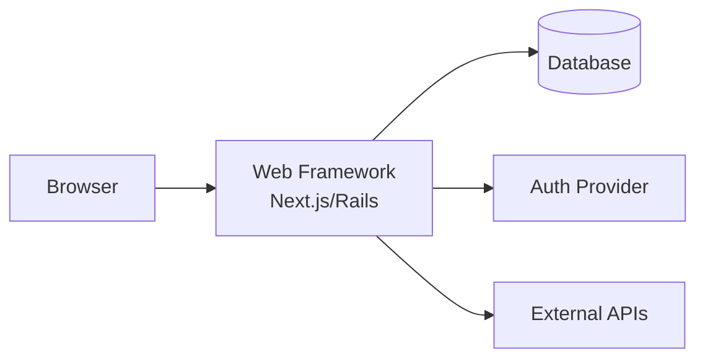

# Playbook: Custom Applications

> **Version**: 1.2 | **Last Updated**: 2026-04-24

## Overview

**What this project type involves**: Building bespoke web applications, mobile apps, or SaaS products. These projects take a client's unique business process or product vision and turn it into working software, from CRUD apps and internal tools to customer-facing products.

**Typical client profile**: Organizations with a workflow or product idea that cannot be solved by off-the-shelf software. They need something tailored to their domain, users, data, and operating model.

**What success looks like**: Users adopt the application, it solves the intended business problem, releases are predictable, quality is measurable, and the system can be maintained by the client's team or a support engagement after delivery.

---

## Discovery Questions

### Business

| # | Question | Phase |
| --- | --- | --- |
| 1 | What business process or product does this application support? | Pre-sales |
| 2 | Who are the primary users? How many? What is their technical skill level? | Pre-sales |
| 3 | Is this replacing an existing system or creating a new capability? | Pre-sales |
| 4 | What business outcome must improve in the first 90 days after launch? | Pre-sales |
| 5 | What does success look like in 6 months? In 2 years? | Pre-sales |
| 6 | Which decisions, exceptions, or approvals must the application make auditable? | Setup |

### Users and Experience

| # | Question | Phase |
| --- | --- | --- |
| 1 | What are the top three user journeys that must work on day one? | Pre-sales |
| 2 | Which workflows are high-frequency, high-risk, or time-sensitive? | Pre-sales |
| 3 | What accessibility expectations apply? WCAG level, assistive technology, keyboard use? | Setup |
| 4 | What devices, browsers, and viewport sizes are in scope for support? | Setup |
| 5 | What user feedback loops will validate adoption and usability after release? | Delivery |

### Technical

| # | Question | Phase |
| --- | --- | --- |
| 1 | What is your hosting environment? Cloud provider, on-premises, or hybrid? | Pre-sales |
| 2 | What existing systems does this need to integrate with? | Pre-sales |
| 3 | What is your current tech stack and team expertise? | Setup |
| 4 | Are there performance requirements? Response time, throughput, concurrent users? | Setup |
| 5 | Which architectural decisions are already constrained by enterprise standards? | Setup |
| 6 | What observability tooling is already approved for logs, traces, metrics, and alerts? | Setup |

### Azure Environment and Deployment

Most custom application projects are Azure-based. Answer these questions early because they drive prerequisites, access, architecture, schedule, and coordination with client platform teams.

Pre-sales should focus on ownership and decision paths, not a complete Azure resource inventory. When the exact services are not known yet, capture whether AIS will have permission to discover and configure the needed resources, or which client group is responsible for providing the information, approvals, and changes during scoping and deployment planning.

| # | Question | Phase |
| --- | --- | --- |
| 1 | Does the client already have an Azure tenant, billing relationship, enterprise agreement, and subscription structure we can use? | Pre-sales |
| 2 | If not, who owns Azure onboarding, billing setup, and CSP coordination? | Pre-sales |
| 3 | Which tenant and subscriptions are in scope, and are they new or existing? | Pre-sales |
| 4 | Will environments share a subscription, or will dev, QA/stage, and production be isolated by subscription? Prefer subscription isolation when governance, billing, or blast-radius concerns justify it. | Pre-sales |
| 5 | Which environments are required, and what is each environment called by the client? Dev, QA, test, stage, UAT, production? | Setup |
| 6 | Which Azure regions are approved, or who can confirm approved regions when the service choices are known? Are there data residency, latency, or service availability constraints? | Setup |
| 7 | Which management groups, Azure Policy constraints, naming standards, tag requirements, and cost allocation rules apply, or which client team owns those answers? | Setup |
| 8 | What resource group ownership model will apply? Can AIS create resource groups, or will the client create them and grant access? | Setup |
| 9 | What RBAC access will AIS receive? Subscription Contributor to create resource groups, or Contributor scoped to client-created resource groups? Who grants and approves that access? | Setup |
| 10 | Will AIS be given direct environment access for deployment and configuration, or is this an over-the-shoulder/client-run environment? | Pre-sales |
| 11 | If deployment is over-the-shoulder, is AIS expected to ship deployable code/packages/IaC only, actively assist during client-run deployments, or both? | Pre-sales |
| 12 | Can AIS receive broad access in lower environments and deploy to upper environments through controlled identities and support-only human access paths? | Setup |
| 13 | Which deployment identity pattern is approved, or who decides it? GitHub Actions OIDC, Azure DevOps service connection, service principal, managed identity, or another pattern? | Setup |
| 14 | Who can create or manage Microsoft Entra app registrations, service principals, federated credentials, secrets, owner assignments, and consent grants? Confirm whether Application Developer, Application Administrator, Cloud Application Administrator, application-owner delegation, or a custom role is required. | Setup |
| 15 | Who can validate and register required Azure resource providers once the resource list is known? Are provider registrations blocked by policy or role scope? | Setup |
| 16 | Who owns service quota and SKU validation once the architecture identifies required services? Who requests quota increases for compute, App Service, Container Apps, Azure OpenAI, database, networking, or regional SKU limits? | Setup |
| 17 | Will application resources be public, private/VNet-only, or mixed, or who owns that security posture decision? | Pre-sales |
| 18 | If public access may be required, who decides the approved ingress pattern? Azure Front Door, Application Gateway with WAF, API Management, App Service access restrictions, or another edge control? | Setup |
| 19 | If private access or zero trust is required, who owns the landing zone decision? Will this workload be a spoke in an existing hub-and-spoke landing zone, or does the landing zone need to be created? | Pre-sales |
| 20 | If private networking is needed, who provides or approves address space, subnet model, private endpoints, private DNS zones, DNS resolvers, forwarding rules, route tables, firewall rules, and egress controls? | Setup |
| 21 | Who owns the access path for end users, developers, and support staff to private resources? ExpressRoute, VPN, Bastion, jump host, privileged workstation, or client-managed access path? | Setup |
| 22 | Which client groups and approval paths must be involved? Azure platform, networking, firewall, identity, security, DNS, architecture review, change advisory, procurement, or operations? | Pre-sales |

### Quality and Testing

| # | Question | Phase |
| --- | --- | --- |
| 1 | What quality standards are non-negotiable for this client or domain? | Setup |
| 2 | What unit test coverage target should apply to domain logic and service logic? | Setup |
| 3 | Which workflows require functional or end-to-end test coverage before release? | Setup |
| 4 | What test data can be used safely in local, CI, staging, and demo environments? | Setup |
| 5 | Which defects should block release versus become backlog items? | Delivery |
| 6 | Who reviews test evidence before production deployment? | Delivery |

### Data

| # | Question | Phase |
| --- | --- | --- |
| 1 | What data does this application manage? Volume, sensitivity, ownership? | Pre-sales |
| 2 | Are there data migration needs from existing systems? | Pre-sales |
| 3 | What are the backup, restore, retention, and deletion requirements? | Setup |
| 4 | What personally identifiable, regulated, or contractual data handling rules apply? | Setup |
| 5 | How will data quality issues be surfaced, corrected, and audited? | Delivery |

### Operations and Deployment

| # | Question | Phase |
| --- | --- | --- |
| 1 | Who will maintain this application after delivery? | Pre-sales |
| 2 | What is your CI/CD maturity? Manual deploy, GitHub Actions, Azure DevOps, other? | Setup |
| 3 | What uptime requirements exist? Business hours, SLA, 24/7? | Setup |
| 4 | What environments are required? Local, dev, test, staging, UAT, production? | Setup |
| 5 | What approval gates are required before deployment to each environment? | Setup |
| 6 | What rollback, restore, and incident response expectations apply? | Delivery |

---

## Governing Questions

Use these questions to keep the delivery approach honest as specs move from discovery to implementation.

| Question | Decision It Governs | Evidence to Produce |
| --- | --- | --- |
| What must always be true for the core business workflow? | Domain model, validation, invariants | Acceptance criteria, unit tests, domain test matrix |
| Which user paths are too important to validate manually? | Functional test scope | Automated functional tests for critical paths |
| What standards define "done" for code, tests, UX, security, and operations? | Constitution and quality gates | Project standards checklist and CI enforcement |
| What defects are release blockers? | Release governance | Severity definitions and release checklist |
| What can fail in production and how will the team know? | Observability and support model | Alerts, dashboards, runbook, incident owner |
| How will the team deploy safely? | Deployment planning | Environment plan, release steps, rollback plan |
| What Azure prerequisites must exist before implementation starts? | Cloud onboarding and schedule risk | Tenant/subscription decision, CSP path if needed, management group/subscription/resource group map |
| What is the environment isolation boundary? | Azure landing zone and cost governance | Subscription/resource group/VNet strategy, tagging rules, cost ownership |
| What access model lets AIS build lower environments while protecting production? | RBAC, identity, and release governance | Access matrix, PIM/JIT expectations, deployment identity plan |
| Who owns every Azure, network, DNS, firewall, identity, security, and approval dependency? | Stakeholder coordination | RACI, named contacts, approval path, escalation path |
| Is the application public, private, or hybrid from a network perspective? | Security architecture and scope | Ingress/egress diagram, WAF/private endpoint/DNS plan |
| What should be configurable versus custom code? | Maintainability and tenant/client variance | Configuration inventory and ADRs |
| What should not be built? | Scope control | Out-of-scope list and backlog triage |

---

## Typical Architecture Patterns

### Pattern: Server-Side Rendered Web App

**When to use**: Content-heavy applications, SEO requirements, simpler interactivity. Internal tools, dashboards, CMS-backed sites.

**Components**: Web framework such as Next.js, Rails, or Django; database; server-side rendering; auth; deployment pipeline.

**Trade-offs**: Simpler architecture, better SEO, faster initial load. Less flexible than SPA patterns for highly interactive UI.

### Pattern: SPA + API Backend

**When to use**: Highly interactive UIs, real-time features, mobile app alongside web, or independent frontend and backend delivery tracks.

**Components**: SPA frontend such as React or Vue; REST or GraphQL API; database; auth; CDN; API gateway where needed.

**Trade-offs**: Rich interactivity and reusable API. More complex deployment, security, and SEO posture than server-rendered apps.

### Pattern: Mobile-First with Shared API

**When to use**: Primary audience is mobile, offline capability is needed, or native device capabilities matter.

**Components**: Native or cross-platform mobile app; shared API; push notifications; offline sync; crash reporting; app store release process.

**Trade-offs**: Best mobile UX and platform-specific capability. Higher delivery cost and more release coordination.

### Pattern: Modular Monolith

**When to use**: Most custom business applications with one team, a bounded domain, and no proven need for distributed services.

**Components**: Single deployable application with internal modules for domain areas, shared infrastructure, database, and background jobs.

**Trade-offs**: Lower operational complexity and easier testing. Requires module boundaries and code ownership discipline to avoid becoming a ball of mud.

### Pattern: Event-Driven Workflow

**When to use**: Long-running workflows, asynchronous integrations, audit-heavy processes, or actions that should not block the user request.

**Components**: Application/API, queue or event bus, workers, durable storage, retry policy, dead-letter handling, observability.

**Trade-offs**: Improves resilience and responsiveness. Adds operational complexity and requires careful idempotency, ordering, and replay design.

---

## Common Spec Decomposition

| Area | Spec Scope | Effort Range | Frequency |
| --- | --- | --- | --- |
| Auth and User Management | Registration, login, roles, permissions, profile | S-M | Always |
| Core Domain Model | Primary entities, relationships, business rules, invariants | M-L | Always |
| Primary Workflow | Main user journey through the application | M-L | Always |
| Standards and Constitution | Coding standards, testing standards, Definition of Done | S | Always |
| Test Strategy | Unit, integration, functional, regression, test data approach | S-M | Always |
| Deployment Foundation | Environments, CI/CD, configuration, secrets, rollback | M | Always |
| Admin Interface | Configuration, user management, content management | S-M | Often |
| Notifications | Email, push, in-app notifications | S-M | Often |
| Search | Full-text search, filtering, sorting | S-M | Often |
| Reporting and Analytics | Dashboards, exports, usage analytics | M | Often |
| File Management | Upload, storage, processing, serving | S-M | Sometimes |
| Integration Layer | Third-party API connections, webhooks, retries | M | Sometimes |
| Data Migration | Import from legacy system, validation, reconciliation | M-L | Sometimes |
| Observability and Support | Logging, metrics, traces, alerts, runbooks | S-M | Often |

---

## Standards and Practices

| Standard Area | Baseline Expectation | Evidence |
| --- | --- | --- |
| Code Style | Automated formatter and linter run in CI | CI logs, formatter config, lint config |
| Architecture | Module boundaries and dependency direction are documented | Architecture notes, ADRs, package/module layout |
| API Contracts | Public API behavior is documented and versioned when needed | OpenAPI/GraphQL contracts, contract tests |
| Accessibility | User-facing screens follow agreed WCAG target | Accessibility checklist, automated scan, manual keyboard checks |
| Security | Auth, authorization, validation, secrets, and dependency scanning are covered | Threat notes, security tests, CI scan output |
| Testing | Test pyramid is explicit and enforced for critical behavior | Coverage report, functional test report |
| Observability | Production behavior can be diagnosed without attaching a debugger | Logs, traces, metrics, dashboards, alerts |
| Operations | Deployment, rollback, backup, and restore paths are documented | Runbook, release checklist, restore evidence |

---

## Testing Strategy Patterns

### Unit Testing

Use unit tests for domain rules, validation, calculations, permissions, transformations, and other behavior that can be verified without infrastructure. Unit tests should be fast, deterministic, and isolated from networks, clocks, random values, and external services unless those dependencies are controlled.

**Baseline target**: Agree on the coverage threshold in the project constitution. Default to at least 80% line or branch coverage for domain and service logic, with explicit tests for every critical business rule.

### Integration Testing

Use integration tests for database mappings, API boundaries, auth policies, background workers, queues, storage providers, and third-party adapters. Prefer realistic dependencies in CI when feasible, with test containers or managed ephemeral resources.

### Functional Testing

Use functional or end-to-end tests for the user paths that define release readiness. Cover happy paths, common failure paths, role-based access, validation messages, and at least one smoke test for every major workflow.

### Regression Testing

Keep a named regression suite for defects that escaped to QA, UAT, or production. A fixed defect should usually add a test at the lowest effective level, plus functional coverage when the defect affected a critical user journey.

### Test Data

Define safe, repeatable test data for local development, CI, demos, UAT, and production smoke checks. Do not use production data in lower environments unless it is approved, masked, and governed.

---

## Functional Test Matrix

| Workflow Type | Minimum Coverage | Release Expectation |
| --- | --- | --- |
| Authentication and session handling | Login, logout, expired session, unauthorized access | Must pass before every release |
| Role-protected workflow | At least one allowed and one denied path per role | Must pass before every release |
| Primary business workflow | Happy path, validation failures, save/resume if applicable | Must pass before every release |
| Data-changing admin action | Create, update, deactivate/delete, audit trail | Must pass before production release |
| Integration-backed workflow | Success, timeout/failure, retry or recovery behavior | Must pass before integration release |
| Reporting/export workflow | Filter, generate, download, permission boundary | Must pass when feature changes |

---

## Deployment Planning

| Area | Planning Questions | Required Output |
| --- | --- | --- |
| Environments | Which environments exist and what is each used for? | Environment map |
| Configuration | What differs by environment and where is it managed? | Configuration inventory |
| Secrets | Who owns secret creation, rotation, and access? | Secret ownership matrix |
| Azure Tenant and Subscriptions | What tenant, billing model, management group, subscription, and environment isolation model will be used? | Azure landing zone decision record |
| Azure Governance | What Azure Policy, naming, tagging, regional, and cost allocation standards apply, and who owns unknown answers? | Governance and cost ownership notes |
| Resource Groups | What resource group model applies, who creates the groups, who owns them, and what naming/tagging standards apply? | Resource group plan |
| Azure Access | What human and workload identities need access at subscription, resource group, or resource scope, and which upper-environment access paths are support-only or over-the-shoulder? | RBAC and deployment identity matrix |
| App Registrations | Who creates app registrations, service principals, federated credentials, credentials/secrets, consent grants, and application ownership assignments? | Identity setup plan |
| Resource Providers | Who can validate and register required providers once the resource list is known? | Provider registration checklist |
| Quotas and SKU Availability | Who validates service, regional, and SKU quotas once the architecture identifies required services, and who owns quota increase requests? | Quota validation and increase plan |
| Networking | Is the workload public, private, or hybrid, who owns that decision, and how does it connect to existing hub, DNS, firewall, and routing controls? | Network architecture diagram |
| Database Changes | Are schema changes backward compatible and reversible? | Migration and rollback notes |
| Release Flow | Will AIS deploy directly, ship deployable artifacts/IaC for the client to deploy, assist over-the-shoulder, or use a mixed model? What approvals and checks are required before production? | Release checklist |
| Rollback | How does the team revert app, config, and data changes? | Rollback plan |
| Smoke Tests | What proves the deployment is healthy? | Post-deploy smoke checklist |
| Monitoring | What alerts show user-impacting failure? | Dashboard and alert list |
| Support | Who responds to incidents and how are they escalated? | Support runbook |

### Deployment Quality Gates

| Gate | Criteria | Severity |
| --- | --- | --- |
| Repeatable Build | Build uses pinned dependencies and runs from source in CI | MUST |
| Automated Deployment | Non-production deployments are automated before production launch | MUST |
| Environment Parity | Staging/UAT represents production topology and configuration classes | SHOULD |
| Migration Safety | Database migrations are tested against realistic data volume | MUST |
| Rollback Tested | Rollback path is documented and tested before launch | MUST |
| Smoke Tests | Automated or scripted smoke checks run after deployment | MUST |
| Observability Ready | Logs, metrics, traces, and alerts are active before go-live | MUST |

---

## Estimation Patterns

### Effort Drivers

- **Number of user roles and permission complexity**: each role adds authorization logic, UI variations, and test paths.
- **Workflow complexity**: multi-step processes with branching logic take more design, implementation, and functional testing.
- **Integration count**: each external system has unique API patterns, failure modes, and test environment constraints.
- **Quality bar**: higher coverage, accessibility, security, and compliance requirements increase engineering and review time.
- **Deployment complexity**: multiple environments, approval gates, data migrations, and rollback needs add coordination and automation work.
- **Azure governance complexity**: new subscriptions, strict RBAC, app registrations, policy constraints, provider registration, quota requests, and unclear client ownership can add lead time before feature work starts.
- **Network security posture**: private endpoints, hub-and-spoke routing, firewall rules, WAF, DNS forwarding, ExpressRoute, VPN, or Bastion requirements add architecture and coordination effort.
- **Offline requirements**: offline-first adds sync logic, conflict resolution, local storage, and failure testing.
- **Data migration**: migrating from legacy systems is unpredictable because data quality varies.

### ROM Ranges by Complexity

| Complexity | Typical Range | Key Indicators |
| --- | --- | --- |
| Simple | 200-500 hours | Single user role, CRUD operations, no integrations, standard auth, simple deployment |
| Moderate | 500-1200 hours | 2-3 roles, complex workflows, 1-3 integrations, file handling, automated CI/CD |
| Complex | 1200-2500 hours | Multi-tenant, complex permissions, many integrations, offline support, data migration, formal release gates |

### Common Multipliers

- **Accessibility (WCAG AA)**: 1.2-1.3x for comprehensive accessibility compliance.
- **Multi-language (i18n)**: 1.2x per additional language.
- **Data migration**: add 100-400 hours depending on source complexity.
- **Formal test evidence**: add 10-20% when every release requires documented test evidence and client signoff.
- **Regulated deployment process**: add 10-25% when change advisory, segregation of duties, or validation evidence is required.

---

## Risk Patterns

| # | Risk | Likelihood | Impact | Mitigation |
| --- | --- | --- | --- | --- |
| 1 | Requirements change during implementation: "that is not what I meant" | High | High | Spec-driven approach with client review at each phase. Demo after each spec implementation. |
| 2 | Integration APIs are undocumented, unreliable, or different from spec | Medium | High | Prototype integrations early. Build adapter pattern for isolation. Test failures and retries. |
| 3 | Performance issues under real load | Medium | Medium | Define load assumptions early. Load test before launch. Monitor production behavior. |
| 4 | Low user adoption after launch | Medium | High | Involve real users in spec validation. Conduct usability testing before full rollout. |
| 5 | Scope creep through small UI tweaks | High | Medium | Define acceptance criteria per spec. Track UI refinement as separate backlog unless it blocks adoption. |
| 6 | Test coverage exists but misses business-critical behavior | Medium | High | Tie tests to governing questions, acceptance criteria, and defect history. Review test evidence. |
| 7 | Manual deployment causes inconsistent releases | Medium | High | Automate builds and deployments. Use environment-specific configuration and release checklists. |
| 8 | No clear production owner | Medium | High | Assign support ownership, escalation path, runbook, and transition checklist before go-live. |
| 9 | Data migration surprises delay launch | Medium | High | Profile source data early. Run trial migrations and reconciliation before cutover. |
| 10 | Azure prerequisites are discovered after implementation begins | Medium | High | Confirm tenant, subscriptions, resource groups, RBAC, app registrations, resource providers, and quotas during discovery and kickoff. |
| 11 | Zero-trust or private networking requirements expand scope late | Medium | High | Decide public/private/hybrid access up front. Involve network, firewall, DNS, security, and Azure platform teams before architecture is committed. |
| 12 | Ownership is unclear across client platform teams | High | Medium | Build a RACI with named contacts for Azure, networking, firewall, DNS, identity, security, approvals, and operations. |

---

## Tech Stack Recommendations

| Layer | Default | Alternatives | Notes |
| --- | --- | --- | --- |
| Frontend | Next.js (React) on Azure-approved hosting | TBD | Keep browser client architecture aligned with the approved Azure deployment path. |
| Backend API | C# / ASP.NET Core | Python (FastAPI), Node.js | Default to .NET unless client standards or project constraints justify another approved runtime. |
| Database | SQL Server / Azure SQL | TBD | Use SQL Server as the default relational store; consider Azure Cosmos DB only when the data model requires document, distributed, or globally replicated patterns. |
| Auth | Microsoft Entra ID | TBD | Use Entra-based identity and authorization patterns by default. |
| File Storage | Azure Blob Storage / ADLS Gen2 | TBD | Use Blob or ADLS based on access, analytics, lifecycle, and governance needs. |
| Testing | xUnit + Playwright | TBD | Keep unit and functional layers distinct; add Azure Load Testing when load evidence is required. |
| Observability | Application Insights + Azure Monitor | TBD | Align logs, metrics, traces, dashboards, and alerts with the client's Azure operating model. |
| Deployment | Azure PaaS deployment path | TBD | Prefer the simplest approved Azure PaaS runtime, such as App Service, Azure Functions, Container Apps, or Static Web Apps. |
| CI/CD | GitHub Actions | Azure DevOps | Use GitHub Actions as the primary pipeline path unless the client requires Azure DevOps. |

---

## Quality Gates

| Gate | Category | Criteria | Severity |
| --- | --- | --- | --- |
| Responsive Design | UX | Application works on supported mobile, tablet, and desktop viewports | MUST |
| Accessibility | UX | Agreed WCAG target is validated for all user-facing pages | SHOULD |
| Auth Security | Security | Authentication and authorization tested for privilege escalation | MUST |
| Input Validation | Security | All user inputs validated server-side and errors handled safely | MUST |
| Dependency Hygiene | Security | Dependency and secret scans run in CI | MUST |
| Code Standards | Maintainability | Formatter, linter, and agreed static checks run in CI | MUST |
| Unit Coverage | Testing | Constitution-defined coverage target met for domain and service logic | MUST |
| Functional Coverage | Testing | Critical workflows have automated functional or end-to-end tests | MUST |
| Regression Coverage | Testing | Escaped defects add regression tests at the lowest effective level | SHOULD |
| Performance | Performance | P95 page load and API response targets meet agreed thresholds | SHOULD |
| Error Handling | Reliability | Error states have user-safe messages, structured logs, and support context | MUST |
| Deployment Readiness | Operations | Release checklist, rollback plan, and smoke tests exist before launch | MUST |
| Observability | Operations | Logs, metrics, traces, alerts, and ownership are in place for production | MUST |

---

## Deliverable Checklist

### Pre-Sales Phase

- [ ] User role definitions and primary workflows identified
- [ ] Critical user journeys and release-blocking workflows identified
- [ ] Integration inventory with access and test environment requirements
- [ ] Technology recommendation aligned with client capabilities
- [ ] Azure tenant, subscription, billing, CSP, and environment isolation approach or owner path understood
- [ ] Direct access versus over-the-shoulder deployment model and code-shipping/deployment-assist expectations captured
- [ ] Public, private, or hybrid network posture or owner path identified
- [ ] Required client stakeholder groups, owners, escalation paths, and approval boards identified
- [ ] Quality, compliance, and deployment expectations captured

### Kickoff Phase

- [ ] Design system or UI framework selected
- [ ] Development environment and CI pipeline established
- [ ] Coding standards, test standards, and Definition of Done documented
- [ ] Database schema design and migration approach drafted
- [ ] Authentication and authorization approach validated
- [ ] Environment map, configuration inventory, and secret ownership documented
- [ ] Azure resource group plan, RBAC matrix, deployment identity plan, and app registration ownership documented
- [ ] Resource provider registration needs and service quota risks checked
- [ ] Network, DNS, routing, firewall, ingress, egress, and private access requirements documented

### Per-Spec Phase

- [ ] Working feature matches acceptance criteria
- [ ] Unit tests cover business rules and edge cases
- [ ] Integration tests cover infrastructure and external boundaries
- [ ] Functional tests cover critical user paths
- [ ] Accessibility, security, and performance considerations reviewed
- [ ] API documentation updated when applicable
- [ ] Release notes or deployment notes updated when behavior changes

### Release Phase

- [ ] CI build is clean and repeatable
- [ ] Test evidence reviewed for release-blocking workflows
- [ ] Database migration tested against realistic data
- [ ] Rollback plan reviewed and feasible
- [ ] Post-deploy smoke test checklist prepared
- [ ] Monitoring and alerts verified

### Closeout Phase

- [ ] Production deployment completed with monitoring
- [ ] User documentation or in-app help delivered
- [ ] Operations runbook covers deployment, backup, restore, and troubleshooting
- [ ] Support ownership and escalation path confirmed
- [ ] Knowledge transfer completed with client team
- [ ] Backlog of known limitations, deferred hardening, and future enhancements handed off

---

## Anti-Patterns

| Anti-Pattern | Why It Is Bad | What to Do Instead |
| --- | --- | --- |
| Building the whole UI before any backend | Disconnected frontend that needs rework when integrated | Build vertical slices: one feature end-to-end at a time |
| Rolling custom auth by default | Security vulnerabilities and maintenance burden | Use managed auth unless there is a specific justified reason |
| Ignoring mobile responsiveness until polish | Fundamental layout rework is needed late in the project | Start with responsive design from the first spec |
| Over-abstracting for future flexibility | Adds complexity without proven benefit | Build for current requirements and refactor when new requirements prove the need |
| Skipping load testing | The app works in dev but fails under realistic production load | Load test with realistic user counts before launch |
| Treating coverage percentage as the goal | High coverage can still miss critical business behavior | Tie tests to business rules, risk, acceptance criteria, and defect history |
| Relying only on end-to-end tests | Slow, brittle suites make feedback late and failures hard to diagnose | Put most logic in unit tests, use integration tests for boundaries, and reserve E2E for critical journeys |
| Manual production deploys from a developer machine | Releases are inconsistent, hard to audit, and hard to reproduce | Deploy from CI/CD using controlled credentials and release records |
| No rollback plan | Failed releases become incident improvisation | Plan rollback, test it, and define who makes the rollback decision |
| Environment-specific code branches | Behavior diverges across environments and defects hide until production | Use configuration and feature flags, not conditional code paths |
| Committing secrets or test credentials | Credentials leak and rotation becomes urgent incident work | Use approved secret stores and local developer setup guidance |
| Deferring observability until after launch | Production issues cannot be diagnosed quickly | Add logs, metrics, traces, and alerts as part of feature delivery |
| Treating admin access as a workaround for missing UX | Admin bypasses can create audit, security, and data integrity problems | Design supported operational workflows with permissions and audit trails |
| One giant spec for the whole application | Delivery becomes hard to review, test, estimate, and demo | Decompose into thin, testable, releasable vertical slices |
