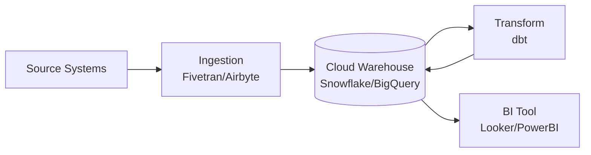

# Playbook: Data Platforms

> **Version**: 1.0 | **Last Updated**: 2026-03-11

## Overview

**What this project type involves**: Building data infrastructure — data warehouses, data lakes, ETL/ELT pipelines, analytics platforms, real-time streaming, and business intelligence. These projects move, transform, and serve data from operational systems into analytical systems where it can drive decisions.

**Typical client profile**: Organizations drowning in data across siloed systems — they can't get a single view of their business, reports take too long, or they're migrating from legacy BI tools. Often triggered by a specific analytics need that reveals deeper infrastructure gaps.

**What success looks like**: Data flows reliably from source to destination, transforms are auditable and repeatable, analysts can self-serve, and the platform scales with growing data volume and user demand.

---

## Discovery Questions

### Business

| # | Question | Phase |
|---|----------|-------|
| 1 | What decisions are you trying to make with data that you can't make today? | Pre-sales |
| 2 | Who are the data consumers? (analysts, executives, data scientists, applications) | Pre-sales |
| 3 | What's your current reporting cadence? (real-time, daily, weekly, ad-hoc) | Pre-sales |
| 4 | What are the regulatory/compliance requirements for your data? (GDPR, HIPAA, SOX) | Pre-sales |

### Technical

| # | Question | Phase |
|---|----------|-------|
| 1 | What are your current data sources? (databases, SaaS APIs, files, streaming) | Pre-sales |
| 2 | What's your cloud platform? Any mandated tools? (Snowflake, Databricks, BigQuery) | Pre-sales |
| 3 | Do you have existing ETL/ELT pipelines? What tools? (Airflow, SSIS, Informatica) | Setup |
| 4 | What's the total data volume and growth rate? | Setup |

### Data

| # | Question | Phase |
|---|----------|-------|
| 1 | What does "a single source of truth" mean to you? Which entities matter most? | Pre-sales |
| 2 | How clean is your source data? Do you have known quality issues? | Setup |
| 3 | Are there data governance policies in place? Data stewards? A data catalog? | Pre-sales |
| 4 | What's the latency requirement? (real-time, near-real-time, batch daily) | Pre-sales |

### Operations

| # | Question | Phase |
|---|----------|-------|
| 1 | Who will operate the platform day-to-day? Do you have data engineers? | Pre-sales |
| 2 | What monitoring/alerting exists for data pipelines today? | Setup |
| 3 | What's your testing strategy for data quality? | Design |

---

## Typical Architecture Patterns

### Pattern: Modern Data Stack (ELT)

**When to use**: Cloud-native analytics with structured data from SaaS and databases. The standard for most analytics projects.

**Components**: Ingestion (Fivetran/Airbyte), cloud warehouse (Snowflake/BigQuery), transformation (dbt), orchestration (Airflow/Dagster), BI (Looker/PowerBI)

**Trade-offs**: Fast to set up, great for analytics. Less suited for real-time or unstructured data. Vendor costs can scale with data volume.

### Pattern: Data Lakehouse

**When to use**: Mix of structured and unstructured data, ML workloads alongside analytics, or very large data volumes where warehouse costs are prohibitive.

**Components**: Object storage (S3/ADLS), table format (Delta/Iceberg), query engine (Spark/Trino), orchestration, catalog (Unity/Hive)

**Trade-offs**: More flexible and cost-effective at scale. Higher complexity, requires more engineering skill.

### Pattern: Real-Time Streaming

**When to use**: Sub-second latency requirements — fraud detection, live dashboards, event-driven architectures.

**Components**: Event bus (Kafka/Kinesis), stream processing (Flink/Spark Streaming), serving layer, monitoring

**Trade-offs**: Powerful for real-time. Significantly more complex to build, test, and operate than batch.

---

## Common Spec Decomposition

| Area | Spec Scope | Effort Range | Frequency |
|------|-----------|--------------|-----------|
| Data Ingestion Pipeline | Source connectors, incremental loads, error handling | M-L | Always |
| Data Warehouse / Lake Design | Schema design, table formats, partitioning, access control | M | Always |
| Transformation Layer | dbt models, data quality tests, documentation | M-L | Always |
| Orchestration | DAGs, scheduling, dependency management, alerting | S-M | Always |
| Data Quality Framework | Validation rules, anomaly detection, freshness monitoring | S-M | Often |
| BI / Analytics Layer | Dashboards, semantic models, self-service analytics | M-L | Often |
| Data Catalog / Governance | Metadata management, lineage, access policies | M | Sometimes |
| Historical Migration | Backfill existing data, validate against legacy | M-L | Sometimes |
| Real-Time Streaming | Event ingestion, stream processing, serving | L-XL | Sometimes |

---

## Estimation Patterns

### Effort Drivers

- **Number of data sources** — each source has unique schema, API patterns, and quality issues
- **Data volume and latency** — real-time adds 2-3x complexity over batch
- **Data quality of sources** — dirty data requires extensive cleaning and validation
- **Number of consumers / dashboards** — each analytical output has its own requirements
- **Compliance requirements** — GDPR, HIPAA add governance and audit trail work

### ROM Ranges by Complexity

| Complexity | Typical Range | Key Indicators |
|-----------|--------------|----------------|
| Simple | 200-400 hours | 2-5 sources, batch daily, single warehouse, basic dashboards |
| Moderate | 400-900 hours | 5-15 sources, mix of batch/near-real-time, data quality framework, multiple consumer types |
| Complex | 900-2000 hours | 15+ sources, real-time streaming, ML integration, multi-tenant, heavy compliance |

### Common Multipliers

- **Legacy migration** — 1.3-1.5x for parallel-running old and new systems
- **Data quality remediation** — 1.2-1.5x if source data has known issues
- **Compliance/audit** — 1.2-1.4x for GDPR, HIPAA, SOX requirements

---

## Risk Patterns

| # | Risk | Likelihood | Impact | Mitigation |
|---|------|-----------|--------|------------|
| 1 | Source data quality worse than expected — garbage in, garbage out | High | High | Data profiling sprint early. Build quality gates. Document quality issues as findings, not failures. |
| 2 | Scope creep via "one more source" or "one more dashboard" | High | Medium | Define source list in SOW. New sources are change requests. |
| 3 | Performance degradation as data volume grows | Medium | High | Design for 10x current volume. Load test with realistic data volumes. |
| 4 | Vendor lock-in to expensive cloud warehouse | Medium | Medium | Use open table formats (Iceberg/Delta). Abstract warehouse-specific SQL. |
| 5 | Lack of data stewardship post-delivery | Medium | High | Define operational roles in SOW. Include runbook and training as deliverables. |

---

## Tech Stack Recommendations

| Layer | Default | Alternatives | Notes |
|-------|---------|-------------|-------|
| Warehouse | Snowflake | BigQuery, Databricks SQL, Redshift | Match client's cloud provider |
| Ingestion | Fivetran | Airbyte, custom Python | Fivetran for SaaS sources; custom for complex APIs |
| Transformation | dbt | Dataform, Spark SQL, custom | dbt is the standard; Spark for very large scale |
| Orchestration | Airflow (managed) | Dagster, Prefect, Azure Data Factory | Managed Airflow (MWAA, Cloud Composer) reduces ops |
| Storage | S3 / ADLS | GCS | Match cloud provider |
| BI | Power BI | Looker, Tableau, Metabase | Power BI for Microsoft shops; Looker for Google |
| Data Quality | dbt tests + Great Expectations | Soda, Monte Carlo | Start with dbt tests; add observability tool for monitoring |
| Catalog | Unity Catalog / DataHub | Amundsen, OpenMetadata | Unity if on Databricks; DataHub for multi-platform |

---

## Quality Gates

| Gate | Category | Criteria | Severity |
|------|----------|----------|----------|
| Data Freshness | Reliability | All critical pipelines complete within SLA (e.g., before 6 AM) | MUST |
| Data Quality Tests | Quality | All dbt tests pass; zero critical quality failures | MUST |
| Row Count Validation | Quality | Source-to-target row counts match within tolerance (e.g., 0.1%) | MUST |
| Pipeline Idempotency | Reliability | Re-running a pipeline produces the same result | SHOULD |
| Data Lineage | Governance | All tables have documented lineage from source to consumption | SHOULD |
| Query Performance | Performance | P95 dashboard queries complete in < 10s | SHOULD |

---

## Deliverable Checklist

### Pre-Sales Phase

- [ ] Source system inventory with data volume estimates
- [ ] Target architecture pattern selection
- [ ] ROM with per-source effort breakdown

### Kickoff Phase

- [ ] Data profiling results for all sources
- [ ] Schema design (staging, transform, serving layers)
- [ ] Pipeline architecture with orchestration design

### Per-Spec Phase

- [ ] Working pipeline with data quality tests
- [ ] Source-to-target validation results
- [ ] Documentation (lineage, schema, SLA)

### Closeout Phase

- [ ] All pipelines in production with monitoring
- [ ] Operations runbook (failure handling, reprocessing, scaling)
- [ ] Data quality dashboard for ongoing monitoring
- [ ] Training for data team

---

## Anti-Patterns

| Anti-Pattern | Why It's Bad | What to Do Instead |
|-------------|-------------|-------------------|
| Building without data profiling | You'll discover data quality issues during development, causing rework | Profile every source in the first sprint. Document quality issues early. |
| One giant monolithic pipeline | Hard to debug, test, and maintain. One failure cascades everywhere. | Modular pipelines per domain. Independent testing and deployment. |
| Skipping data quality tests | Bad data propagates silently until a stakeholder notices wrong numbers | Build dbt tests alongside every model. Monitor freshness and row counts. |
| Designing for today's volume only | Platform hits scaling walls within months of launch | Design for 10x current volume. Use partitioning, incremental loads. |
| Ignoring the "last mile" (BI) | Beautiful pipelines that nobody uses because dashboards are confusing | Co-design dashboards with consumers. Build semantic models. |
