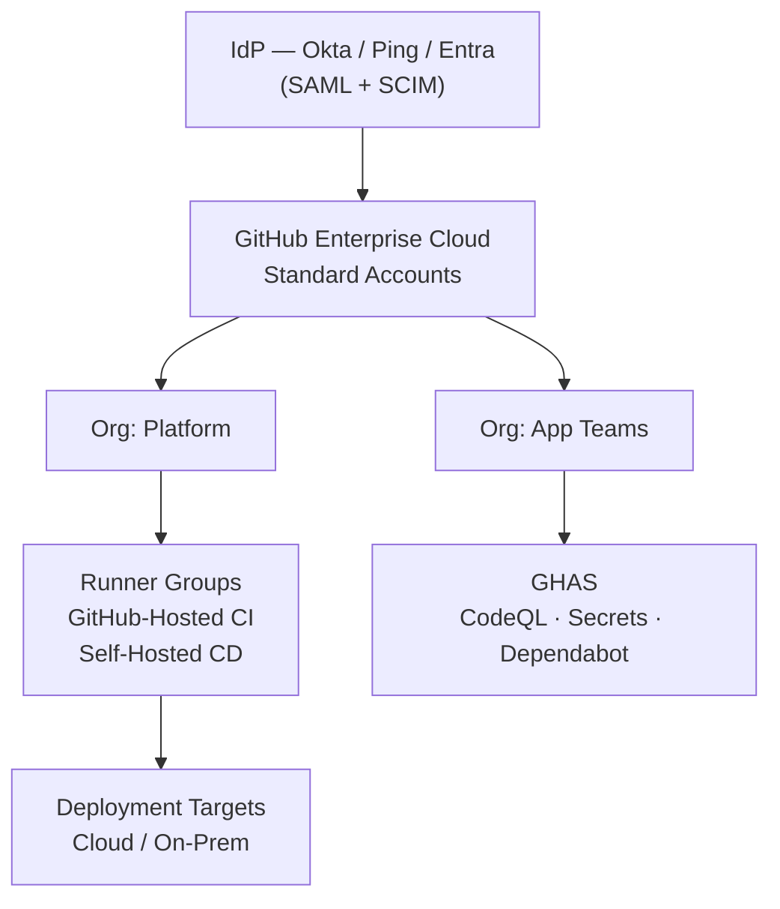
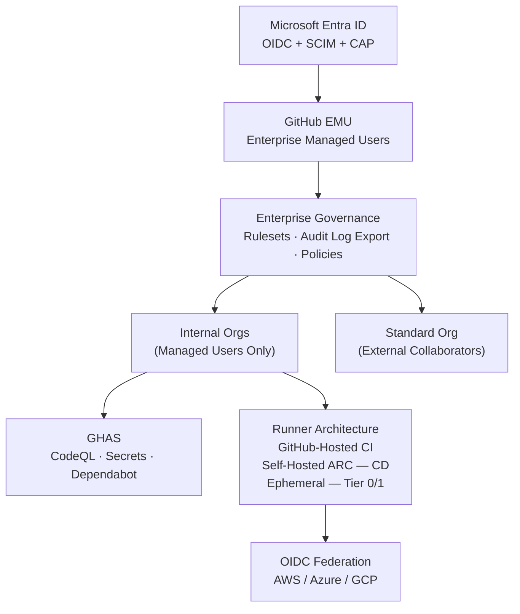
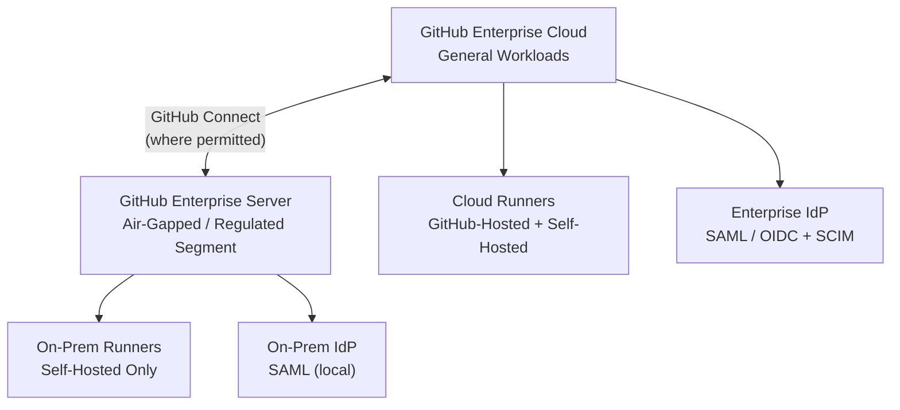

# Playbook: GitHub Enterprise Foundation & Source Control Migration

> **Version**: 1.0 | **Last Updated**: 2026-03-31

## Overview

**What this project type involves**: This engagement establishes GitHub Enterprise Cloud (GHEC) as an organization's unified developer platform while migrating repositories and CI/CD pipelines from non-GitHub source control systems — most commonly Azure DevOps, GitLab, SVN, Bitbucket, or legacy GHES instances. The work spans two tightly coupled tracks: (1) **Foundation** — designing and building the enterprise structure, identity model, governance baseline, runner architecture, security posture, and operating model from the ground up; and (2) **Migration** — executing structured, wave-based movement of repositories, pipelines, and automation into the new platform with validated cutover gates and hypercare.

The engagement is delivered through a structured series of eight decision workshops (WS1–WS8) plus an optional enablement workshop (WS9). Each workshop follows a pattern of guiding principles → concept education → option patterns → decision capture → output artifacts. Workshops produce a signed **blueprint pack** that engineering can execute against. Migration proceeds as a factory — repeatable waves with standard validation checklists, rollback plans, and per-repo acceptance criteria — rather than a one-time event. The result is not just a completed migration but a durable, governed platform that the client can operate and scale independently.

**Typical client profile**: Mid-to-large enterprises with 100–10,000+ developers currently running Azure DevOps, self-hosted GitLab, SVN, or multi-tool combinations. Clients typically face a forcing function: a platform retirement deadline, a contract renewal decision, a compliance audit requirement, an M&A integration, or a mandate to consolidate fragmented CI/CD tooling. They often have limited internal GitHub expertise and need both an architectural blueprint and hands-on execution support. Common profiles include defense contractors, financial services firms, healthcare organizations, government agencies, and technology companies with regulated workloads. Decision-makers are typically VP/Director of Engineering, Platform Engineering leadership, or DevOps/DevSecOps program owners.

**What success looks like**:
- Signed blueprint pack covering identity architecture, org/repo topology, governance baseline, CI/CD design, security posture, migration wave plan, and operating model — delivered within the first 3–4 weeks
- 100% of in-scope repositories migrated with agreed fidelity levels validated against per-repo acceptance checklists
- All pipelines converted to GitHub Actions and running green in target environment before legacy platform decommission
- Identity integration live: SSO/SAML or OIDC + SCIM provisioning active; zero unresolved mannequins from migration
- Baseline governance enforced: org-level rulesets applied, required status checks passing, GHAS enabled per tier
- Hypercare period completed with error rate below threshold, ownership documented, and support path published
- Client platform team capable of operating the new environment: repo factory running, onboarding workflow defined, golden repo available, KPIs instrumented

---

## Discovery Questions

Questions to ask during pre-sales and early discovery, organized by theme. Each notes which phase benefits most.

### Business

| # | Question | Phase |
|---|----------|-------|
| 1 | What are the primary goals and outcomes for this engagement — adoption, migration, consolidation, or all three? | Pre-sales |
| 2 | What is the compelling event driving this engagement right now (platform retirement, contract renewal, audit, M&A, cost reduction, AI enablement mandate)? | Pre-sales |
| 3 | When does the current platform contract or license expire, and what is the hard deadline for migration? | Pre-sales |
| 4 | What does success look like at 30, 60, and 90 days and at program completion — what metrics or milestones define "done"? | Pre-sales |
| 5 | Who is the executive sponsor and who owns GitHub as a platform going forward (central platform team, security, IT, BU)? | Pre-sales |
| 6 | What are the non-negotiables — regulatory constraints, data residency requirements, identity model mandates, network boundary restrictions, or organizational separation requirements? | Pre-sales |
| 7 | What level of commitment do assigned team members have toward this engagement — are they dedicated or splitting time with other priorities? | Pre-sales |
| 8 | Is there an internal project team already formed, or is AIS expected to provide full execution capacity? | Pre-sales |
| 9 | What is the stakeholder map — who must sign off on the blueprint, who approves wave go/no-go decisions, and who owns the platform post-engagement? | Pre-sales |
| 10 | Are there any regulatory, audit, or procurement timelines that constrain the engagement schedule? | Pre-sales |
| 11 | How do you currently measure developer productivity, platform reliability, and security posture — and what should change after migration? | Pre-sales |
| 12 | Describe the role of GitHub in your software engineering culture today — is it used by some teams, all teams, or is it entirely new? | Pre-sales |
| 13 | What are the main challenges you face when delivering software to production today? | Pre-sales |

### Technical

| # | Question | Phase |
|---|----------|-------|
| 1 | Which source control platforms are in scope (Azure DevOps, GitLab self-hosted, GitLab.com, SVN, Bitbucket, GHES, GitHub.com, others)? | Pre-sales / Setup |
| 2 | If migrating from GitHub, which product and version are you currently on (GHES version, GitHub.com plan: Team/Enterprise/Legacy)? | Pre-sales / Setup |
| 3 | How many repositories are in scope? How many are active vs. dormant vs. should be archived rather than migrated? | Pre-sales / Setup |
| 4 | How many repositories exceed 2 GB (monorepos)? How many exceed 5 GB? What is the average and maximum repository size? | Pre-sales / Setup |
| 5 | Are there binary files or large files stored in repositories? Are you currently using Git LFS, and if so, what is the estimated volume? | Setup |
| 6 | What repository types exist in scope — application, infrastructure/IaC, shared libraries, data/ML, documentation? Which are regulated? | Setup |
| 7 | Are there submodules, monorepos, mirrored repos, or multi-remote patterns requiring special handling? | Setup |
| 8 | What needs to be migrated — full branch history, tips of all branches, or tip of main only? | Setup |
| 9 | Is source code only being migrated, or is metadata also required (issues, comments, pull/merge requests, release history, wiki)? | Setup |
| 10 | Which CI/CD systems are in scope (Azure DevOps Pipelines, GitLab CI, Jenkins, CircleCI, Bamboo, Octopus Deploy, others)? How many pipelines/workflows? | Setup |
| 11 | What runner or executor footprint exists today — GitHub-hosted, self-hosted VMs, Kubernetes-based runners — and who operates it? | Setup |
| 12 | What is the current promotion model — build once deploy many, or rebuild per environment? What artifact types are produced (containers, packages, IaC)? | Setup |
| 13 | Which artifact registries are in use (ACR, ECR, Artifactory, Nexus, GHCR) and what retention and immutability rules exist? | Setup |
| 14 | Are there corporate network restrictions for accessing GitHub — IP allow-lists, VPN-only requirements, or private connectivity needs? | Setup |
| 15 | Will self-hosted runners require access to internal resources (private registries, vaults, private clusters) and from which network zones? | Setup |
| 16 | Which secrets management systems are in use (Azure Key Vault, HashiCorp Vault, CyberArk, Akeyless) and is OIDC federation supported? | Setup |
| 17 | Are there manual approvals, environment gates, or change tickets required before production deployments today? | Setup |
| 18 | Do you have an internal developer portal or catalog (Backstage, custom) that indexes repos and teams and will need updates? | Setup |
| 19 | Is there a need to migrate existing CI/CD workflows — e.g., GitHub Actions from GHES or GHEC, or pipelines from Azure DevOps, GitLab CI, CircleCI, or Bamboo? | Setup |
| 20 | Do you wish to learn how to create custom GitHub Actions, leverage GitHub APIs, or build reusable workflow patterns? | Setup |

### Identity & Security

| # | Question | Phase |
|---|----------|-------|
| 1 | Which Identity Provider is authoritative for your workforce (Entra ID / Azure AD, Okta, Ping, other)? Is it already integrated with other SaaS tools? | Pre-sales / Setup |
| 2 | If migrating to EMU, what Identity Provider are you planning to use (Entra ID or Okta)? | Pre-sales / Setup |
| 3 | How many users need access — employees, contractors, partners — and what is the growth forecast? | Pre-sales |
| 4 | Do any systems currently rely on personal access tokens? Is there a mandate to move to OIDC or short-lived credentials? | Setup |
| 5 | What level of authentication and access control is required — SSO only, SAML, OIDC with Conditional Access, MFA enforcement? | Setup |
| 6 | Do you require data residency — specific region constraints, dedicated enterprise instances, or regulated enclaves? | Pre-sales |
| 7 | Which regulations apply to your environment — SOX, HIPAA, PCI-DSS, FedRAMP, GDPR, ITAR, CJIS, internal security policies? | Pre-sales |
| 8 | What is the required retention period for audit logs and repository data? What is your legal hold and eDiscovery process? | Setup |
| 9 | What evidence is required for audits — approval records, change history, policy enforcement proof, scan results, artifact provenance? | Setup |
| 10 | Do you export audit events to a SIEM or GRC tool? Which tools are in place (Splunk, Sentinel, QRadar, ServiceNow)? | Setup |
| 11 | Are there segregation-of-duties requirements — dev vs. approver vs. deployer — and how are they enforced today? | Setup |
| 12 | What branch and PR controls exist today — required reviews, status checks, signed commits, merge queues, CODEOWNERS? | Setup |
| 13 | What security scanning exists today — SAST, SCA/dependency scanning, secret scanning, container scanning — and which tools? | Setup |
| 14 | Is GitHub Advanced Security (GHAS) in scope? If not, what is the equivalent required security posture? | Pre-sales / Setup |
| 15 | Do you have policies for Actions usage — allowed actions, pinning strategy, marketplace restrictions, reusable workflow governance? | Setup |
| 16 | What is the current exception/waiver process for policy deviations — who approves, duration, evidence required, tracking mechanism? | Setup |
| 17 | Do you require SBOM or provenance (SLSA, attestation) for releases, and who consumes it downstream? | Setup |
| 18 | What level of security is required and what specific areas should be covered (code scanning, secrets, dependencies, container images)? | Pre-sales |
| 19 | Which group will consume scan results — developers, the AppSec team, or security champions within development teams? | Setup |
| 20 | What languages and frameworks are used by in-scope applications (relevant for CodeQL query pack selection)? | Setup |

### Data & Integrations

| # | Question | Phase |
|---|----------|-------|
| 1 | Which integrations must be preserved after migration — Jira/Azure Boards, ServiceNow, Slack/Teams, code quality tools, artifact registries? | Pre-sales / Setup |
| 2 | Do you use webhooks or custom GitHub Apps that rely on org/repo names or API tokens that will break during migration? | Setup |
| 3 | Which developer tools reference GitHub URLs (documentation sites, build scripts, deploy scripts) that require change management? | Setup |
| 4 | How do you currently use open source software, and do you have internal frameworks or shared libraries that must remain discoverable? | Setup |
| 5 | What is the volume of pull requests and issues per month per repo — which repos require high-fidelity migration of PR/issue history? | Setup |
| 6 | Do you have packages or container images stored alongside repositories that must be migrated or migrated to a new registry? | Setup |
| 7 | What is the integration test plan — how will you prove each integration works in the pilot and in each migration wave? | Design |
| 8 | Are there any custom integrations with repositories (bots, automation, ChatOps tools) that must be re-established post-migration? | Setup |

### Operations

| # | Question | Phase |
|---|----------|-------|
| 1 | Who owns the enterprise account and orgs going forward (platform team) vs. who owns repositories (product teams)? | Pre-sales |
| 2 | What is the support model — L1/L2/L3 tiers, escalation path, and on-call expectations for the GitHub platform post-migration? | Design |
| 3 | What is the standard process today for requesting repo creation, access changes, runner capacity, and policy exceptions? | Design |
| 4 | Do you need chargeback or showback for runner spend or license consumption by business unit? | Setup |
| 5 | What is the acceptable downtime or freeze window per team during cutover — hours or days — and what is your rollback tolerance? | Pre-sales |
| 6 | What constitutes "done" per migration wave — validation checklist, attribution remediation, access verified, pipelines green, security checks enforced? | Design |
| 7 | What are the known high-risk repositories or workflows — production deployments, regulated codebases, high-volume pipelines — that must be piloted first? | Pre-sales / Design |
| 8 | Would you like to follow a recommended sequential approach or fast-track with a GitHub Accelerator consecutive-day program? | Pre-sales |

---

## Typical Architecture Patterns

### Pattern: GitHub Enterprise Cloud with Standard Identity (SAML + SCIM)

**When to use**: Organization uses Okta, Ping, or non-Entra IdPs; does not require enterprise-managed user (EMU) accounts; has external collaborators or contractors who need flexible access; Conditional Access IP enforcement is not required.

**Components**:
- GitHub Enterprise Cloud with Standard accounts
- IdP (Okta, Ping, or Entra in SAML mode) for SSO authentication
- SCIM provisioning for user lifecycle (create/suspend/group sync)
- Org-level SAML enforcement per organization
- GitHub-hosted runners for CI + self-hosted runners for CD and private network access
- GHAS: CodeQL + Secret Scanning + Dependency Review
- GitHub Advanced Security with tiered enforcement by repository tier

**Trade-offs**:
- ✅ Simpler external collaborator model — outside collaborators can be added directly
- ✅ Flexible identity model; works with any SAML-compliant IdP
- ✅ Fewer constraints on team/org structure
- ❌ No enterprise-wide identity enforcement — each org enforces SSO independently
- ❌ Users manage their own GitHub.com accounts; shadow accounts possible
- ❌ Cannot enforce Conditional Access Policy (CAP) IP conditions natively

---

### Pattern: GitHub Enterprise Cloud with Enterprise Managed Users (EMU) + OIDC

**When to use**: Organization uses Microsoft Entra ID as authoritative IdP; requires enterprise-wide centralized identity control; needs Conditional Access Policy (CAP) IP enforcement across web, PAT, and SSH; has strict requirements around managed identities and cannot allow self-managed GitHub.com accounts.

**Components**:
- GitHub Enterprise Cloud with Enterprise Managed Users (EMU)
- Microsoft Entra ID as IdP with OIDC protocol (required for CAP)
- SCIM provisioning mandatory for all managed user accounts
- Entra security groups mapped to GitHub teams
- Conditional Access Policies enforcing IP and session conditions
- GitHub-hosted runners (CI) + self-hosted ARC runners (CD) with OIDC federation
- GHAS full suite with tiered enforcement
- Separate standard org for external collaborators (contractors, partners)

**Trade-offs**:
- ✅ Maximum identity control — all accounts managed by IdP, no shadow accounts
- ✅ CAP IP enforcement applies to web sessions, PATs, and SSH keys
- ✅ Enterprise-wide SCIM lifecycle — suspension and deprovisioning are centralized
- ✅ Ideal for regulated, compliance-heavy environments
- ❌ External collaborators cannot use managed accounts — requires a separate Standard org strategy
- ❌ Nested teams not supported for IdP-linked teams — team structure must be redesigned
- ❌ OIDC/CAP only available with Entra ID; Okta EMU customers must use SAML
- ❌ Deploy keys not subject to CAP — service identity strategy must compensate

---

### Pattern: Hybrid GHEC + GHES (Air-Gap or Regulated Enclave)

**When to use**: Organization has air-gapped environments, classified workloads, data sovereignty requirements that GitHub Enterprise Cloud cannot satisfy, or regulatory mandates requiring self-hosted instances. GHEC serves the majority of teams; GHES serves isolated regulated or classified segments.

**Components**:
- GitHub Enterprise Cloud for general-purpose development
- GitHub Enterprise Server (GHES) for air-gapped or restricted segments
- GitHub Connect for shared actions and runner visibility (where network permits)
- Separate identity integration per tier
- Mirror or promotion pipelines between environments (strictly controlled)

**Trade-offs**:
- ✅ Satisfies air-gap and data sovereignty requirements
- ✅ Reduces GHES footprint by limiting it to only what requires self-hosting
- ❌ Operational overhead of maintaining GHES version upgrades and availability
- ❌ Feature parity lag — GHES may trail GHEC by one or more versions
- ❌ Two separate governance and identity configurations to maintain
- ❌ GitHub Connect has limitations; not all features bridge the gap

---

## Common Spec Decomposition

Typical work streams for this engagement type. Use as a starting point for proposed specs in the statement of work.

| Area | Spec Scope | Effort Range | Frequency |
|------|-----------|--------------|-----------|
| WS0: Discovery & Pre-Assessment | Validated inventory (repos, users, pipelines, integrations, runners); constraints register; readiness rating; initial wave hypothesis | S–M | Always |
| WS1: Platform & Licensing | Target platform decision (GHEC/GHES/Hybrid); enterprise account type (Standard/EMU); service enablement plan; network and Codespaces stance | S | Always |
| WS2: Identity & Access | IdP/SSO/SCIM design; attribute mapping; break-glass model; external collaboration pattern; mannequin reclamation strategy | M | Always |
| WS3: Org & Repo Topology | Org model; team taxonomy; repo naming standards; tiering policy; migration tooling selection; archive strategy | M | Always |
| WS4: Governance Baseline | Rulesets and required workflow library; branch strategy; merge policy; environment protection model; release strategy | M | Always |
| WS5: Actions & Runners | Runner architecture by network zone; hosted vs. self-hosted design; ARC auto-scaling; Actions policy; reusable workflow strategy | M–L | Always |
| WS6: CI/CD Architecture | Secrets/OIDC strategy; artifact registry and promotion model; deployment orchestration; template strategy; PAT elimination plan | M–L | Always |
| WS7: Security & GHAS | GHAS posture by tier; CodeQL / Secret Scanning / Dependabot enablement; merge-blocking thresholds; waiver process; audit log export / SIEM integration | M | Always |
| WS8: Migration Factory | Wave plan (pilot + production waves); cutover model; rollback approach; validation checklists; mannequin reclamation; hypercare SOP | L–XL | Always |
| WS9: Enablement & Adoption | Persona-based training; golden repo; repo factory automation; onboarding workflow; success metrics / KPI dashboard | M | Often |
| Foundation Build | Provision enterprise/org structure; configure identity (SSO/SCIM); apply governance baseline; deploy runner infrastructure; enable GHAS | L | Always |
| Pipeline Conversion | Convert source platform pipelines (ADO/GitLab CI/Jenkins) to GitHub Actions; validate against standard workflow library | L–XL | Always |
| Repository Migration | Execute GEI-based or git-native migration waves; apply validation checklists; perform mannequin reclamation; cutover and legacy retirement | L–XL | Always |
| SVN-to-Git Conversion | Convert SVN repositories to Git with commit history and contributor mapping; validate before migration to GHEC | M–L | Sometimes |
| Integration Validation | Re-establish webhooks, GitHub Apps, Jira/Boards links, artifact registry connections, and identity integrations post-migration | M | Always |
| Hypercare & Stabilization | Post-cutover triage support; issue capture and root-cause tagging; error rate monitoring; stakeholder sign-off; legacy decommission | M | Always |

---

## Estimation Patterns

### Effort Drivers

- **Repository count** — primary volume driver; every 50–100 repos adds roughly one wave (1–2 weeks per wave for a standard team)
- **Repository size and LFS usage** — repos over 2 GB require special handling; LFS migration adds tooling complexity and transfer time
- **Migration fidelity required** — full metadata migration (issues, PRs, releases, wiki) multiplies effort vs. source-code-only by 2–3x per repo
- **SVN-to-Git conversions** — SVN repos require conversion prior to migration; add 0.5–1 day per repo depending on history size
- **Pipeline count and complexity** — each ADO or GitLab pipeline requires analysis, rewrite, and validation; 1–4 hours per pipeline depending on complexity; monorepo pipelines with complex templates multiply effort
- **Number of integrations** — each unique integration (Jira, Artifactory, ServiceNow, Vault, etc.) requires design, configuration, and testing; typically 1–3 days per integration type
- **Identity complexity** — EMU with Entra OIDC + CAP + group mapping adds 1–2 weeks vs. simple SAML; complex external collaborator patterns add further
- **Network restrictions** — air-gap, IP allow-list requirements, or private connectivity for runners adds infrastructure design and validation effort
- **Compliance and regulated workloads** — HIPAA, FedRAMP, SOX requirements drive additional documentation, evidence collection, and audit readiness work
- **Client engagement level** — low client SME availability (part-time stakeholders, slow decision cycles) adds 20–30% to overall timeline
- **Existing GitHub maturity** — clients with zero GitHub experience require more workshop time and enablement investment
- **Number of orgs/teams to structure** — large enterprises with many BUs, separation requirements, or RGSA patterns require more topology design work

### ROM Ranges by Complexity

| Complexity | Typical Engagement Range | Key Indicators |
|-----------|--------------------------|----------------|
| **Simple** | 8–12 weeks / 3–5 person-team | 1 source platform, <200 repos, simple identity (standard SAML), <50 pipelines, 1–2 compliance frameworks, strong client GitHub familiarity, few integrations |
| **Moderate** | 12–20 weeks / 4–6 person-team | 1–2 source platforms, 200–600 repos, EMU or complex SAML, 50–200 pipelines, multiple integrations (Jira, Vault, Artifactory), moderate compliance requirements, mixed client maturity |
| **Complex** | 20–36 weeks / 5–8 person-team | Multiple source platforms (ADO + GitLab + SVN), 600–2,000+ repos, EMU + CAP + Entra, 200+ pipelines, multi-cloud runners across AWS and Azure, heavy compliance (FedRAMP / SOX / HIPAA), air-gap or GHES segments, low client GitHub maturity |

> **Note**: Ranges assume a standard AIS delivery team composition (PM, DevOps Architect, Lead DevOps Engineer, Senior DevOps Engineer, Senior Infrastructure Engineer). Larger teams compress timeline; smaller teams extend it.

### Common Multipliers

- **SVN source platform** — add 25–40% to repository migration effort; SVN-to-Git conversion is a prerequisite step
- **Full metadata migration required** — multiply per-repo migration time by 2–3x vs. source-only; GEI handles this for supported sources
- **Multiple source platforms** — add one additional discovery/planning sprint per additional platform
- **EMU vs. Standard identity** — add 1–2 weeks to identity design and configuration; external collaboration model adds further complexity
- **Multi-cloud runner architecture** — separate runner pools per cloud boundary (AWS + Azure) add 1–2 weeks of infrastructure design and validation
- **Air-gap or GHES segment** — add 3–6 weeks for GHES provisioning, upgrade planning, and GitHub Connect configuration
- **GHAS remediation backlog** — if client requires remediation of found vulnerabilities before milestone sign-off, timeline extends based on backlog volume
- **Low client SME availability** — multiply overall timeline by 1.2–1.3; decision workshops drag when stakeholders are part-time
- **Phased rollout across >5 business units** — each BU may require its own wave planning, stakeholder alignment, and hypercare window

---

## Risk Patterns

Domain-specific risks with mitigations.

| # | Risk | Likelihood | Impact | Mitigation |
|---|------|-----------|--------|------------|
| 1 | Hard deadline (platform retirement, contract end) creates schedule pressure that forces shortcuts in validation and governance design | High | High | Surface deadline in pre-sales; size the team to meet it; identify what can be phased post-cutover; negotiate MVP definition early |
| 2 | Identity model selection (Standard vs. EMU) made too late or changed mid-engagement, requiring re-architecture | Medium | High | Run WS1 and WS2 first; treat identity model as irreversible decision; document in blueprint and get stakeholder sign-off before foundation build begins |
| 3 | Mannequin reclamation not planned early enough, leaving historical commits unattributed in production repos | Medium | Medium | Include mannequin strategy in WS2; execute reclamation per wave closeout; provide CSV-based bulk mapping tooling |
| 4 | Pipeline conversion underestimated — ADO/GitLab pipelines are more complex than expected, often with embedded secrets, dynamic templates, or environment-specific logic | High | High | Audit pipeline inventory during WS0; tier pipelines by complexity; use a conversion factory with standard templates; pilot on Tier 2 pipelines first |
| 5 | Runner architecture not designed for private network access, causing CI/CD failures for repos that require internal resources | Medium | High | Map network zones during WS5; deploy self-hosted runners before first wave; test OIDC federation and vault access in pilot before production cutover |
| 6 | Secrets not migrated or re-created before cutover, breaking pipelines on day one | High | High | Create secrets inventory during WS6; migrate secrets to GitHub Environments/Vault before pipeline go-live; validate all secrets in pilot wave |
| 7 | GHAS alerts block merges unexpectedly in production repos, disrupting engineering velocity | Medium | High | Roll out GHAS in advisory mode first; define merge-blocking thresholds per tier in WS7; provide a waiver process before enforcement goes live |
| 8 | External collaborators locked out after EMU adoption with no documented access pattern | Medium | High | Define external collaboration model in WS2; provision Standard org for externals before cutover; document SOP and test with at least one external partner in pilot |
| 9 | Wave scope creep — additional repos, pipelines, or integrations discovered during migration that were not in the original inventory | High | Medium | Require a validated inventory before wave plan is finalized; include a 10–15% buffer in schedule; establish a change control process for scope additions |
| 10 | Client SME unavailability delays workshop decisions and slows wave execution | High | Medium | Establish RACI and required stakeholder availability in kickoff; escalate missed decisions to PM and sponsor; document AIS recommendations as defaults when client cannot decide |
| 11 | Rollback to legacy platform not possible after decommission window, increasing blast radius of migration issues | Low | High | Keep legacy platform in read-only mode for a defined stabilization period; document rollback triggers; test rollback procedure in pilot before production waves |
| 12 | IP allow-list conflicts with GitHub Codespaces if both are required | Medium | Medium | Decide Codespaces stance before IP allow-list configuration in WS1; choose CAP IP conditions (Entra+OIDC) as alternative when Codespaces is required |
| 13 | Deploy key proliferation creates untracked service identity surface area that bypasses CAP and SSO enforcement | Medium | High | Audit deploy keys during WS0; restrict for Tier 0/1 in WS7; migrate to GitHub Apps or OIDC service identities; document exceptions with expiry |
| 14 | Long-lived PATs used in automation survive migration and become security debt | High | Medium | Inventory PATs during WS0; define PAT elimination timeline in WS6; enforce GitHub Apps or OIDC for new automation; require PAT owners to rotate or remove before hypercare exit |
| 15 | Governance rulesets applied incorrectly cause PRs to be blocked in active repos immediately after cutover | Medium | High | Test rulesets in a sandbox org before applying to production; apply in warning/audit mode first; include ruleset validation in per-repo acceptance checklist |

---

## Tech Stack Recommendations

| Layer | Default | Alternatives | Notes |
|-------|---------|-------------|-------|
| **Target Platform** | GitHub Enterprise Cloud (GHEC) | GitHub Enterprise Server (GHES) for air-gap/regulated; GHEC+GHES hybrid | GHEC first unless hard constraints require GHES; cloud-first reduces operational burden |
| **Identity Model** | EMU with Entra ID + OIDC | Standard SAML (Okta, Ping, Entra); EMU with Okta + SAML | EMU preferred for regulated/compliance-heavy clients; Standard for simpler identity or Okta shops without CAP requirement |
| **SCIM Provisioning** | Enabled enterprise-wide with IdP group → team mapping | Per-org SCIM (Standard only); manual provisioning (not recommended) | Always enable SCIM lifecycle; define deprovision mode (soft vs. hard) explicitly |
| **Migration Tooling** | GitHub Enterprise Importer (GEI) for GitHub/ADO/GitLab→GHEC | `git clone --mirror` for simple source-code-only migrations; custom scripts for edge cases | GEI for Tier 1/2 where supported; git-native for Tier 0 or unsupported sources; SVN requires svn2git conversion first |
| **CI/CD Engine** | GitHub Actions with reusable workflow library | Retain legacy runner (bridge pattern) during transition only | Standardize on Actions; avoid hybrid CI where possible post-migration |
| **Runner Architecture** | GitHub-hosted runners (CI) + ephemeral self-hosted ARC runners (CD/private network) | Persistent self-hosted VMs (lower ops burden); Kubernetes-based ARC | Ephemeral runners for Tier 0/1; hosted runners for general CI; separate runner groups per network boundary |
| **Secrets Management** | GitHub Environments + OIDC federation for cloud targets | HashiCorp Vault integration; Azure Key Vault; CyberArk | OIDC preferred for cloud deployments to eliminate long-lived secrets; Vault integration for non-cloud or sensitive workloads |
| **Artifact Registry** | GitHub Container Registry (GHCR) | Artifactory, Nexus, ACR, ECR | GHCR for net-new; retain enterprise registry if Artifactory/Nexus already established and in use; define promotion model |
| **Code Scanning** | CodeQL with default query packs | SARIF-compatible third-party tools (Checkmarx, Veracode, Snyk); hybrid | CodeQL baseline for all in-scope languages; add SARIF for third-party tools already in client stack |
| **Dependency Scanning** | Dependabot (alerts + security updates + version updates) | Snyk, OWASP Dependency Check (via SARIF) | Dependabot as baseline; supplement with Snyk if client has existing investment |
| **Secret Scanning** | GitHub Secret Scanning + Push Protection | Gitleaks (via SARIF), TruffleHog | Native secret scanning + push protection as default; push protection blocks commits at source |
| **Audit Log Export** | GitHub audit log streaming → SIEM | Native audit log API polling; third-party connectors | Stream to Splunk, Sentinel, or QRadar; define alert rules and retention during WS7 |
| **Governance as Code** | Terraform (GitHub provider) for org/repo/team provisioning | Pulumi; custom GitHub Actions automation; `github-org-manager` | Terraform GitHub provider for idempotent org management; pair with repo factory automation |

---

## Quality Gates

Domain-specific gates to seed the project constitution. All gates apply to each migration wave unless otherwise noted.

| Gate | Category | Criteria | Severity |
|------|----------|----------|----------|
| Blueprint Signed | Planning | All eight workshop decision tables completed, reviewed, and signed by client stakeholders before foundation build begins | MUST |
| Inventory Validated | Planning | Repository count, pipeline count, integration list, and user count confirmed against source platform; variance <5% from pre-sales estimate | MUST |
| Identity Live | Foundation | SSO authentication working for all in-scope users; SCIM provisioning creating/suspending accounts correctly; break-glass credentials stored and tested | MUST |
| Foundation Green | Foundation | Enterprise structure provisioned; org-level rulesets applied; baseline runner groups operational; GHAS features enabled per tier; audit log streaming active | MUST |
| Pilot Wave Validated | Migration | Pilot repositories migrated; pipelines running green; secrets available; GHAS enabled; integrations validated; mannequins mapped; go/no-go recorded with approvers | MUST |
| Per-Repo Acceptance | Migration | For each migrated repo: visibility correct, default branch set, rulesets applied, required workflows pass, runner labels resolve, secrets present, GHAS enabled per tier, releases/tags present per agreement, integrations healthy | MUST |
| Pipeline Smoke Test | Migration | All converted pipelines pass a successful end-to-end run (build + test + deploy to non-production) before legacy platform decommission | MUST |
| Mannequin Reclamation Complete | Migration | Zero unresolved mannequins for in-scope repositories at wave closeout; reclamation CSV filed and applied | MUST |
| Rollback Tested | Migration | Rollback procedure documented and tested in pilot wave; rollback trigger criteria defined and agreed with client | MUST |
| Security Baseline Enforced | Security | Secret scanning + push protection active; Dependabot alerts enabled; CodeQL running on baseline schedule; merge-blocking thresholds applied per tier | MUST |
| Waiver Inventory Captured | Security | All known policy exceptions documented with owner, expiry date, and approval evidence before hypercare exit | SHOULD |
| PAT Inventory Filed | Security | All personal access tokens inventoried; elimination timeline defined; break-glass PATs documented with owners and rotation schedule | SHOULD |
| Audit Log Alerts Active | Security | At least critical event categories (org admin changes, member removal, ruleset bypass) alerting in SIEM before hypercare exit | SHOULD |
| Ownership Documented | Operations | Every migrated repo has CODEOWNERS populated; team assignments confirmed; support path published to development teams | MUST |
| Hypercare Exit Criteria Met | Operations | Error rate below defined threshold; no open P1 issues; stakeholder sign-off obtained; legacy platform set to read-only | MUST |
| Golden Repo Available | Adoption | Reference repository demonstrating standards end-to-end (rulesets, required workflows, GHAS, CODEOWNERS, environment protections) published and linked in developer docs | SHOULD |
| Repo Factory Operational | Adoption | Self-service repo creation mechanism (issue form, ServiceNow, or Terraform) applying tier defaults automatically; SLA defined | SHOULD |
| KPIs Instrumented | Adoption | At minimum: % repos compliant, GHAS alert volume by severity, runner utilization, time-to-first-PR for new repos | SHOULD |

---

## Deliverable Checklist

### Pre-Sales Phase

- [ ] Scoping questions completed by client (all sections: Goals, Migration, Code Security, Platform Security, CI/CD, Collaboration, Additional Context)
- [ ] Preliminary repository inventory (count, source platforms, approx sizes)
- [ ] Preliminary pipeline inventory (count, source platforms, rough complexity)
- [ ] Compliance and regulatory requirements identified
- [ ] Proposed engagement model, team composition, and timeline presented
- [ ] Statement of Work drafted with wave plan hypothesis and milestone schedule
- [ ] Rough-order-of-magnitude effort estimate reviewed with client

### Kickoff Phase

- [ ] Project kickoff meeting completed; RACI established
- [ ] Stakeholder map documented; workshop participant list confirmed
- [ ] Validated inventory: users, orgs/projects, repos (active/archive), workflows/pipelines, integrations, runner footprint
- [ ] Constraints register: identity, network, compliance, data residency, separation requirements
- [ ] Readiness rating + gaps: required prerequisites and owners with dates
- [ ] Initial wave sequencing hypothesis documented
- [ ] Workshop schedule confirmed (WS1–WS9)
- [ ] Communication plan for developer community established

### Design Workshop Phase (WS1–WS9)

- [ ] **WS1 Output**: Target platform decision (GHEC/GHES/Hybrid); enterprise account type (Standard/EMU); service enablement plan; network/Codespaces stance documented
- [ ] **WS2 Output**: Identity architecture (IdP, SSO protocol, SCIM config); attribute mapping plan; external collaboration SOP; break-glass model; mannequin reclamation strategy
- [ ] **WS3 Output**: Org topology diagram; team taxonomy; repo naming and taxonomy standards; tiering policy; migration tooling selection per tier; archive criteria
- [ ] **WS4 Output**: Governance baseline (rulesets, branch strategy, merge policy, required checks, environments); cookbook library selections per tier
- [ ] **WS5 Output**: Runner architecture diagrams; runner group design; Actions policy (allow-list, pinning strategy); reusable workflow strategy; automation identity standard
- [ ] **WS6 Output**: Secrets/OIDC strategy; artifact registry design; promotion model; deployment orchestration pattern; PAT elimination plan; token migration timeline
- [ ] **WS7 Output**: GHAS posture by tier (CodeQL, secret scanning, Dependabot, push protection); merge-blocking thresholds; waiver process; SIEM integration plan; compliance evidence workflow
- [ ] **WS8 Output**: Wave plan (pilot + production waves); cutover model and rollback approach; validation checklists; hypercare SOP; integration dependency graph; legacy retention plan
- [ ] **WS9 Output** *(if in scope)*: Persona-based enablement plan; golden repo ownership and design; repo factory design; onboarding workflow; success metrics / KPI definitions
- [ ] Blueprint pack compiled and reviewed by client stakeholders
- [ ] Blueprint signed by designated client approvers

### Foundation Build Phase

- [ ] GitHub Enterprise account provisioned; billing and license management configured
- [ ] Organization structure created per topology blueprint
- [ ] SSO/SAML or OIDC configured at enterprise level; tested with pilot users
- [ ] SCIM provisioning active; group-to-team mappings validated
- [ ] Break-glass credentials documented, stored, and tested
- [ ] Enterprise-level rulesets applied; org-level governance baseline live
- [ ] GitHub-hosted runner groups configured; self-hosted runners provisioned and registered
- [ ] OIDC federation configured for target cloud environments (AWS/Azure/GCP)
- [ ] GHAS enabled per tier; push protection active; CodeQL baseline scheduled
- [ ] Audit log streaming active and flowing to SIEM
- [ ] Golden repo published; repo factory initial version operational
- [ ] Foundation build validated; Foundation Green gate signed off

### Migration Execution Phase (Per Wave)

- [ ] Wave scope confirmed; per-repo checklists prepared
- [ ] Secrets and environment variables migrated or re-created before cutover
- [ ] Repositories migrated using agreed tooling (GEI / git-mirror / svn2git)
- [ ] Pipelines converted to GitHub Actions and tested in target environment
- [ ] Per-repo acceptance checklist completed for each repository
- [ ] Mannequins inventoried and reclamation executed (CSV mapping applied)
- [ ] Integration validation completed (webhooks, Apps, Jira/Boards, artifact registries)
- [ ] Wave go/no-go recorded with named approvers and timestamp
- [ ] Legacy repositories set to read-only or archived
- [ ] Wave closeout documented; lessons learned captured for next wave

### Closeout Phase

- [ ] All waves complete; 100% of in-scope repositories migrated and validated
- [ ] All pipelines running green in GitHub Actions; legacy CI/CD decommissioned or frozen
- [ ] Hypercare exit criteria met; error rate below threshold
- [ ] Ownership documentation complete for all migrated repos (CODEOWNERS, team assignments, support path)
- [ ] PAT elimination progress reviewed; break-glass PATs documented
- [ ] Waiver inventory filed with owners and expiry dates
- [ ] KPIs instrumented; initial dashboard published to platform team
- [ ] Final stakeholder sign-off obtained
- [ ] Project retrospective completed; lessons learned documented
- [ ] Transition to steady-state operations completed; client platform team handoff confirmed

---

## Anti-Patterns

Things to watch for and avoid in this engagement type.

| Anti-Pattern | Why It's Bad | What to Do Instead |
|-------------|-------------|-------------------|
| Skipping the blueprint phase and jumping straight to migration | Decisions made ad-hoc during execution create inconsistencies, governance gaps, and rework; teams disagree on standards mid-flight | Run WS1–WS8 first; get the blueprint signed before building; treat discovery as a billable deliverable, not a pre-sales freebie |
| Treating all repositories as equal (one-size-fits-all governance) | Applying Tier 0 controls to sandbox repos destroys developer velocity; applying Tier 2 controls to crown jewel repos creates security and compliance gaps | Implement a tiering model in WS3/WS4; apply tiered rulesets, GHAS thresholds, and runner policies per tier from day one |
| Migrating repositories without converting pipelines first (or in parallel) | Repos in GitHub with pipelines still in ADO/GitLab create a "split brain" that blocks adoption and forces developers to maintain two systems | Treat repo migration and pipeline conversion as a coupled unit per wave; pipelines must be green in GitHub Actions before legacy cutover is declared |
| Delaying identity model decision until mid-engagement | Switching from Standard to EMU (or vice versa) after foundation build requires full re-provisioning and org restructuring | Make the Standard vs. EMU decision in WS1/WS2; treat it as irreversible; lock it down before any access is provisioned |
| Migrating without a validated inventory | Repos discovered during migration that weren't in the plan cause scope creep, extend timelines, and blow wave plans | Require a validated inventory before SOW is signed; build a 10–15% buffer into the wave plan for inventory variance |
| Enabling GHAS in blocking mode immediately on production repos | Existing codebases almost certainly have vulnerabilities; hard-blocking merges on day one stops engineering work and creates adversarial relationships with development teams | Roll out GHAS in advisory/informational mode first; define blocking thresholds per tier in WS7; give teams a remediation window before enforcement goes live |
| Allowing long-lived PATs to survive migration | Long-lived PATs are unscoped, don't expire automatically, and don't obey CAP or GHAS controls; they become persistent security debt | Inventory PATs during WS0; define an elimination timeline in WS6; migrate automation to GitHub Apps and OIDC; never let PATs "carry over" without an explicit owner and expiry |
| Migrating SVN repositories directly without Git conversion | SVN and Git have fundamentally different branching and history models; direct migration without conversion produces unusable repositories | Use svn2git or git-svn for conversion; validate commit history and contributor mapping before treating the Git repo as migration input |
| Building org structure that mirrors the organizational chart | Org-chart-mirrored structures create silos, make cross-team collaboration difficult, require constant restructuring as the org evolves, and multiply governance overhead | Design orgs as governance boundaries (separation, compliance, BU-level control), not org chart units; use teams and CODEOWNERS for ownership within orgs |
| Skipping hypercare and handing off immediately at migration complete | Post-migration issues (broken integrations, missing secrets, identity sync problems, pipeline failures) require rapid response; without hypercare, they become production incidents | Define hypercare scope, duration, and exit criteria in WS8; staff the hypercare period with at minimum a Lead Engineer and PM; document triage SOP and communication cadence |
| Running all waves simultaneously without a pilot | Running the full migration factory without validating the approach on a small pilot wave means errors are discovered at scale, multiplying the blast radius and rework cost | Always run a pilot wave on 5–10 representative repos covering different tiers and source platforms; sign off on the pilot before opening the production factory |
| Allowing teams to create repositories without governance defaults | Repos created outside the factory bypass rulesets, GHAS enablement, naming standards, and team assignments; governance baseline degrades over time | Implement repo factory automation before migration begins; ensure every new repo gets tier defaults, CODEOWNERS, required workflows, and GHAS applied at creation time |

---

## Appendix: Workshop Decision Capture Reference

Each of the eight workshops produces a decision table. The following summarizes the key decisions to capture per workshop for the blueprint. Use these as facilitation prompts.

### WS1 — Platform & Licensing Decisions
- Target platform (GHEC / GHES / Hybrid)
- Enterprise account type (Standard / EMU)
- Service enablement cadence (all at once / phased by wave / phased by org)
- External collaboration stance (open / controlled / prohibited)
- Billing and chargeback model (central / BU / cost centers)
- Network restriction model (GitHub IP allow list / Entra CAP IP conditions / none)
- Codespaces stance (in scope / out of scope; decide before IP allow-list configuration)

### WS2 — Identity & Access Decisions
- Identity provider (Entra ID / Okta / Ping / other)
- SSO protocol (SAML / OIDC — OIDC preferred with Entra+CAP)
- SCIM provisioning scope (enterprise-wide / per-org / none)
- Unique identifier attribute (EmployeeID / immutable UPN / custom claim)
- Group-to-team mapping strategy (naming convention, nested group handling)
- External collaboration model (outside collaborators / separate Standard org / partner org)
- SCIM deprovision mode (soft / hard — document reinstatement expectations)
- Deploy key policy (allowed / restricted / prohibited per tier)
- Mannequin reclamation timing (per wave / end of program)
- Break-glass model (setup-user custody, recovery code storage, rotation procedure)

### WS3 — Org & Repo Topology Decisions
- Org model (single / BU-domain / RGSA enclave)
- Team model (product-only / platform+product hybrid / org-chart mirror — avoid mirror)
- Repository model (multi-repo by service / monorepo / hybrid)
- Repository tier definitions and criteria (Tier 0–3)
- Default tier for new repos (recommendation: Tier 2)
- Discoverability standards (topics, README standards, CODEOWNERS, templates)
- Migration tool per tier (GEI / git-native / svn2git / hybrid)
- Wave unit (org-first / repo-first / hybrid)
- Archive criteria and process for dormant repos

### WS4 — Governance Baseline Decisions
- Branch strategy (trunk / trunk+release* / GitFlow — trunk preferred)
- Merge policy (squash / merge commit / rebase / merge queue)
- Required reviews per tier (1 review / 2 reviews / CODEOWNERS required)
- Required status checks per tier (CI only / CI+security / tiered)
- Ruleset scope (repo-only / org rulesets / enterprise+org layered)
- Environment protection model (none / nonprod+prod baseline / per stage)
- Bypass policy (who can bypass, evidence required, audit trail)
- Waiver workflow (intake system, approvers, expiry, reporting cadence)

### WS5 — Actions & Runners Decisions
- Runner strategy (hosted / persistent self-hosted / ephemeral / hybrid)
- Runner ownership (per-team / per-org / enterprise runner groups)
- Network placement per zone (cloud-native / private network access / isolated)
- Actions policy (allow all / allow-list + pin / enterprise-curated only)
- Reusable workflow strategy (none / templates / central platform-owned repo)
- Automation identity standard (GitHub Apps for integrations / OIDC for cloud deploy / PATs only break-glass)
- Codespaces stance confirmed relative to IP allow-list decisions

### WS6 — CI/CD Architecture Decisions
- Secrets strategy (GitHub secrets / Vault / Vault+OIDC — OIDC preferred for cloud)
- Artifact platform (GHCR / external registry / hybrid)
- Promotion model (promote artifacts / rebuild per environment — promote preferred)
- Deployment orchestration (repo-driven / environment repo / centralized pipeline)
- Reusable workflow and template ownership model
- PAT elimination milestones and break-glass controls

### WS7 — Security & GHAS Decisions
- GHAS posture (none / tiered / enterprise-wide — tiered is default)
- Secret scanning mode (off / on / on+push protection — push protection for Tier 1/2)
- Code scanning tool (CodeQL / SARIF hybrid / third-party)
- Dependency updates (Dependabot / external tool / none)
- Merge-blocking thresholds per tier (severity levels that block PRs)
- Audit log export and SIEM alerting configuration
- Waiver process (ad-hoc / formal with expiry — formal is required)
- SBOM and provenance requirements

### WS8 — Migration Execution Decisions
- Wave unit (org-first / repo-first / hybrid)
- Cutover model (big bang / phased / freeze window / dual-write)
- Rollback approach (none / documented / tested — tested is required)
- Validation rigor (light / standard / high assurance)
- Legacy retention model (read-only period / archive / decommission timeline)
- Adoption model (central / federated / hybrid champion network)
- Hypercare scope, duration, and exit criteria

---

*This playbook is a living document. Update after each engagement with new patterns, risk discoveries, estimation data, and anti-patterns encountered in the field.*
