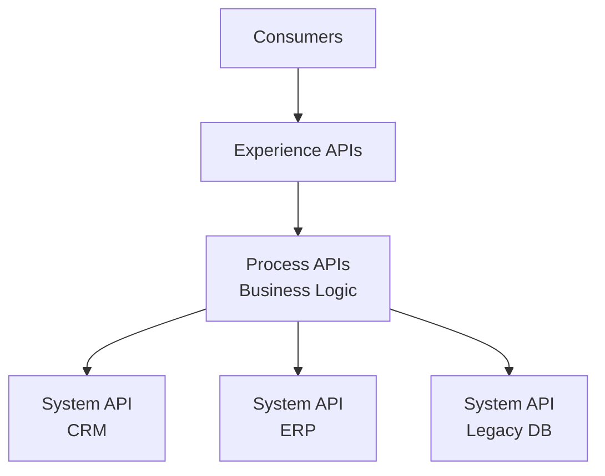

# Playbook: Integration Projects

> **Version**: 1.0 | **Last Updated**: 2026-03-11

## Overview

**What this project type involves**: Connecting existing systems — API gateways, ETL pipelines, event-driven architectures, B2B integrations, and system-to-system data flows. The challenge is making disparate systems work together reliably without modifying the systems themselves.

**Typical client profile**: Organizations with multiple systems that don't talk to each other — silos causing manual data entry, inconsistent data, or delayed processes. Often triggered by a new system purchase (CRM, ERP) that needs to connect to existing infrastructure.

**What success looks like**: Data flows between systems automatically, reliably, and with full auditability. Manual processes are eliminated. Systems stay in sync without human intervention.

---

## Discovery Questions

### Business

| # | Question | Phase |
|---|----------|-------|
| 1 | What systems need to talk to each other? What's the business trigger? | Pre-sales |
| 2 | What manual processes are you trying to eliminate? | Pre-sales |
| 3 | What happens when data is out of sync between systems today? | Pre-sales |
| 4 | What's the business impact of integration downtime? | Pre-sales |

### Technical

| # | Question | Phase |
|---|----------|-------|
| 1 | What APIs/interfaces do the source and target systems expose? | Pre-sales |
| 2 | Are there API rate limits, authentication requirements, or version constraints? | Setup |
| 3 | Do you have an existing integration platform (MuleSoft, Dell Boomi, Azure Logic Apps)? | Pre-sales |
| 4 | What's the data format? (JSON, XML, CSV, EDI, proprietary) | Setup |

### Data

| # | Question | Phase |
|---|----------|-------|
| 1 | What's the data volume and frequency? (real-time, hourly, daily, on-demand) | Pre-sales |
| 2 | Are there data transformation requirements between systems? | Setup |
| 3 | How do you handle data conflicts? (which system is the source of truth?) | Pre-sales |
| 4 | Are there data sensitivity or compliance constraints? | Pre-sales |

### Operations

| # | Question | Phase |
|---|----------|-------|
| 1 | Who monitors integrations today? What happens when they fail? | Pre-sales |
| 2 | What's the error handling expectation? (retry, dead-letter, alert, manual intervention) | Setup |
| 3 | Do you need audit trails for compliance? | Pre-sales |

---

## Typical Architecture Patterns

### Pattern: API-Led Connectivity

**When to use**: Multiple systems need to share data through well-defined APIs. Standard for enterprise integration.

**Components**: API gateway, system APIs (per source), process APIs (business logic), experience APIs (consumer-specific), monitoring

**Trade-offs**: Clean separation of concerns, reusable APIs. More initial setup. Best for organizations with many integration needs.

### Pattern: Event-Driven Integration

**When to use**: Real-time requirements, many consumers of the same events, loose coupling between systems.

**Components**: Event bus (Kafka/EventBridge), producers, consumers, schema registry, dead-letter queue

**Trade-offs**: Loose coupling, scalable, real-time. Eventually consistent. Harder to debug distributed flows.

### Pattern: Point-to-Point ETL

**When to use**: Simple, low-frequency integrations between 2-3 systems. Batch data synchronization.

**Components**: ETL tool or scripts, scheduler, error handling, logging

**Trade-offs**: Simple to build and understand. Doesn't scale well beyond a few integrations. Becomes spaghetti.

---

## Common Spec Decomposition

| Area | Spec Scope | Effort Range | Frequency |
|------|-----------|--------------|-----------|
| Source System Adapter | API client, auth, rate limiting, error handling per source | S-M (per source) | Always |
| Target System Adapter | Write operations, conflict resolution, validation per target | S-M (per target) | Always |
| Data Mapping / Transform | Field mapping, format conversion, business rules | S-M | Always |
| Orchestration / Workflow | Multi-step processes, saga patterns, rollback | M-L | Often |
| Error Handling & Retry | Dead-letter queue, retry policies, alerting, manual resolution | S-M | Always |
| Monitoring & Observability | Health checks, throughput metrics, latency tracking, alerting | S-M | Always |
| Audit Trail | Logging all transactions, compliance reporting | S-M | Often |
| API Gateway | Rate limiting, auth, routing, versioning | M | Sometimes |
| Historical Data Sync | Initial bulk load, reconciliation, validation | M-L | Sometimes |

---

## Estimation Patterns

### Effort Drivers

- **Number of systems** — each system has unique API patterns, auth, and error modes
- **API quality** — well-documented REST APIs vs. legacy SOAP or proprietary protocols
- **Data complexity** — simple field mapping vs. complex business logic transformations
- **Error handling requirements** — simple retry vs. saga patterns with compensation
- **Compliance requirements** — audit trails and data handling add significant effort

### ROM Ranges by Complexity

| Complexity | Typical Range | Key Indicators |
|-----------|--------------|----------------|
| Simple | 100-300 hours | 2-3 systems, REST APIs, batch daily, simple field mapping |
| Moderate | 300-700 hours | 4-8 systems, mix of API types, near-real-time, business logic transforms |
| Complex | 700-1500 hours | 8+ systems, legacy protocols, real-time, saga patterns, compliance audit trails |

### Common Multipliers

- **Legacy systems** — 1.5-2x per system with poor API documentation or proprietary protocols
- **Compliance audit trails** — 1.2-1.4x for detailed logging and reporting requirements
- **Historical data migration** — add 100-300 hours per system depending on volume and complexity

---

## Risk Patterns

| # | Risk | Likelihood | Impact | Mitigation |
|---|------|-----------|--------|------------|
| 1 | Source system API is unreliable, rate-limited, or poorly documented | High | High | Prototype integration early. Build resilient adapters with circuit breakers and retry. |
| 2 | Data quality issues in source systems cause integration failures | High | Medium | Profile source data. Build validation layer. Define "good enough" quality thresholds. |
| 3 | Vendor API changes break existing integrations | Medium | High | Version APIs. Monitor vendor changelogs. Build adapter pattern for isolation. |
| 4 | Race conditions and ordering issues in real-time integrations | Medium | High | Use idempotent operations. Implement event ordering guarantees. Test with concurrent load. |
| 5 | "System of record" conflicts — who wins when data disagrees | Medium | High | Define conflict resolution rules per entity in the spec. Document in the SOW. |

---

## Tech Stack Recommendations

| Layer | Default | Alternatives | Notes |
|-------|---------|-------------|-------|
| Integration Platform | Azure Logic Apps / AWS Step Functions | MuleSoft, Dell Boomi, Apache Camel | Use client's existing platform if they have one |
| Event Bus | Azure Service Bus / AWS EventBridge | Kafka, RabbitMQ | Kafka for high-throughput; managed service for simplicity |
| API Gateway | Azure API Management / AWS API Gateway | Kong, Apigee | Match cloud provider |
| ETL / Data Transform | Azure Data Factory / AWS Glue | Airbyte, custom Python | ADF/Glue for cloud-native batch; custom for complex logic |
| Monitoring | Application Insights / CloudWatch | Datadog, New Relic | Match cloud provider for cost; Datadog for multi-cloud |
| Schema Management | JSON Schema / OpenAPI | Avro (for Kafka), XML Schema | OpenAPI for REST; Avro for event streaming |

---

## Quality Gates

| Gate | Category | Criteria | Severity |
|------|----------|----------|----------|
| Idempotency | Reliability | All write operations are idempotent — reprocessing produces same result | MUST |
| Error Handling | Reliability | All failure scenarios have defined behavior (retry, dead-letter, alert) | MUST |
| Data Validation | Quality | All inbound data validated before processing | MUST |
| Throughput | Performance | Handles peak volume without backpressure or data loss | SHOULD |
| Audit Trail | Compliance | All transactions logged with source, timestamp, and outcome | SHOULD |
| Monitoring | Operations | Health dashboard with alerting for failures and latency degradation | MUST |

---

## Deliverable Checklist

### Pre-Sales Phase

- [ ] System inventory with API capabilities assessment
- [ ] Data flow diagrams (current state and proposed)
- [ ] Integration pattern recommendation

### Kickoff Phase

- [ ] API access confirmed for all systems
- [ ] Data mapping document (source fields → target fields)
- [ ] Error handling strategy

### Per-Spec Phase

- [ ] Working integration with end-to-end data flow
- [ ] Error handling and retry logic tested
- [ ] Throughput validation at expected volume

### Closeout Phase

- [ ] All integrations in production with monitoring
- [ ] Operations runbook (failure recovery, reprocessing, adding new sources)
- [ ] Data reconciliation report confirming system sync
- [ ] Handoff to operations team

---

## Anti-Patterns

| Anti-Pattern | Why It's Bad | What to Do Instead |
|-------------|-------------|-------------------|
| Point-to-point spaghetti | Each new integration adds exponential complexity | Use an integration layer (API gateway, event bus) for routing |
| Assuming APIs work as documented | Vendor docs are often wrong, incomplete, or outdated | Prototype every integration in the first sprint |
| Fire-and-forget with no monitoring | Silent failures cause data drift between systems | Monitor every integration. Alert on failure. Track data freshness. |
| Tight coupling to vendor API shapes | Vendor API changes break everything downstream | Build adapter layer. Map to internal canonical models. |
| Ignoring ordering and idempotency | Duplicate processing, race conditions, data corruption | Design for at-least-once delivery. Make all operations idempotent. |
