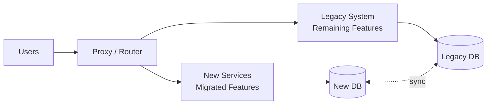

# Playbook: Modernization

> **Version**: 1.0 | **Last Updated**: 2026-03-11

## Overview

**What this project type involves**: Migrating, re-platforming, or re-architecting existing systems. These projects take legacy applications (monoliths, on-prem systems, outdated stacks) and modernize them for cloud, maintainability, and scale. The spectrum ranges from lift-and-shift to full rewrites.

**Typical client profile**: Organizations running business-critical systems on aging technology — maintenance costs are rising, talent is hard to find, and the system can't adapt to new requirements. Often triggered by end-of-support announcements, cloud mandates, or acquisition/merger requiring system consolidation.

**What success looks like**: The modernized system delivers equivalent functionality with improved performance, maintainability, and operational cost. Users experience minimal disruption during transition. The new system is on a sustainable technology stack.

---

## Discovery Questions

### Business

| # | Question | Phase |
|---|----------|-------|
| 1 | Why now? What's driving the modernization? (EOL, cost, compliance, growth) | Pre-sales |
| 2 | What's the risk tolerance for downtime during migration? | Pre-sales |
| 3 | Is this a lift-and-shift, re-platform, or full rewrite? | Pre-sales |
| 4 | What's the timeline pressure? (hard deadline like EOL vs. strategic initiative) | Pre-sales |

### Technical

| # | Question | Phase |
|---|----------|-------|
| 1 | What's the current architecture? (monolith, SOA, microservices, mainframe) | Pre-sales |
| 2 | What's the current tech stack and deployment model? | Pre-sales |
| 3 | Are there undocumented features or tribal knowledge? | Setup |
| 4 | What's the test coverage of the existing system? | Setup |

### Data

| # | Question | Phase |
|---|----------|-------|
| 1 | What's the data volume and where does it live? | Pre-sales |
| 2 | Are there database schema changes needed? | Setup |
| 3 | What's the data migration strategy? (big bang, phased, dual-write) | Setup |
| 4 | Are there data integrity constraints or referential relationships? | Setup |

### Operations

| # | Question | Phase |
|---|----------|-------|
| 1 | Who operates the current system? How is it deployed? | Pre-sales |
| 2 | What's the monitoring and alerting state of the current system? | Setup |
| 3 | What's the rollback strategy if something goes wrong? | Setup |
| 4 | Can you run old and new systems in parallel? | Pre-sales |

---

## Typical Architecture Patterns

### Pattern: Strangler Fig

**When to use**: Incrementally replacing a monolith. Lowest risk approach. Allows gradual migration with rollback capability.

**Components**: Proxy/router, new services, legacy system, feature flags, data sync

**Trade-offs**: Lowest risk, incremental delivery. Longer timeline. Requires routing layer and potentially dual data stores.

### Pattern: Parallel Run (Big Bang)

**When to use**: When the system is small enough for a complete replacement, or when the legacy system is truly end-of-life and can't be maintained.

**Components**: Complete new system, data migration tools, validation suite, cutover plan

**Trade-offs**: Clean break from legacy. High risk — if the new system has issues, there's no incremental fallback. Requires extensive testing.

### Pattern: Re-Platform (Lift and Modernize)

**When to use**: The application logic is sound but the infrastructure is outdated. Move to cloud and modernize deployment without rewriting business logic.

**Components**: Containerization, cloud services, CI/CD, managed databases, monitoring

**Trade-offs**: Fastest path to cloud. Preserves existing code and business logic. Tech debt carries over.

---

## Common Spec Decomposition

| Area | Spec Scope | Effort Range | Frequency |
|------|-----------|--------------|-----------|
| Legacy Assessment & Documentation | Document existing system, identify features, map dependencies | M | Always |
| Infrastructure Modernization | Cloud setup, containerization, CI/CD, networking | M-L | Always |
| Data Migration | Schema migration, data transfer, validation, reconciliation | M-L | Always |
| Feature Migration (per domain) | Rewrite or re-platform a functional domain | M-L (per domain) | Always |
| Integration Adaptation | Update integrations to work with new architecture | S-M (per integration) | Often |
| Auth & Identity Migration | Move users, credentials, roles to new auth system | S-M | Often |
| Testing & Validation | Regression testing, performance testing, UAT | M | Always |
| Cutover & Rollback | Cutover plan, data sync, rollback procedures, DNS/routing | S-M | Always |
| Monitoring & Observability | New monitoring, alerting, logging for modernized system | S-M | Always |

---

## Estimation Patterns

### Effort Drivers

- **Legacy system complexity** — poorly documented monoliths take longer to understand and migrate
- **Data migration complexity** — schema changes, data cleansing, referential integrity
- **Feature parity requirements** — "it must do exactly what the old system does" adds significant effort
- **Parallel running period** — dual systems require data synchronization and routing
- **Integration count** — each integration that touches the legacy system needs adaptation

### ROM Ranges by Complexity

| Complexity | Typical Range | Key Indicators |
|-----------|--------------|----------------|
| Simple | 300-600 hours | Small app, well-documented, modern-ish stack, lift-and-shift |
| Moderate | 600-1500 hours | Medium app, some documentation, re-platform + partial rewrite, 3-5 integrations |
| Complex | 1500-3000+ hours | Large monolith, poor documentation, full rewrite, many integrations, strict parity requirements |

### Common Multipliers

- **Poor documentation / tribal knowledge** — 1.3-1.5x for discovery and documentation
- **Parallel running requirement** — 1.3-1.5x for dual-system operation and data sync
- **Zero-downtime cutover** — 1.2-1.3x for sophisticated migration and rollback procedures
- **Compliance (SOX, HIPAA)** — 1.2-1.4x for audit trails and validation evidence

---

## Risk Patterns

| # | Risk | Likelihood | Impact | Mitigation |
|---|------|-----------|--------|------------|
| 1 | Undocumented features discovered during migration — "the old system also did X" | High | High | Thorough legacy assessment spec. User interviews. Production monitoring to discover actual usage. |
| 2 | Data migration corrupts or loses data | Medium | Critical | Migrating in phases with validation. Always maintain rollback. Reconciliation checks post-migration. |
| 3 | Performance regression in new system | Medium | High | Benchmark legacy system first. Performance test new system against same baselines. |
| 4 | User resistance to change | Medium | Medium | Involve users in UAT. Maintain familiar UX where possible. Provide training. |
| 5 | Scope creep — "while we're modernizing, let's also add..." | High | High | Strict parity-first approach. New features are separate specs after migration complete. |
| 6 | Legacy system changes during migration | Medium | High | Freeze changes on legacy during migration. If not possible, establish dual-commit process. |

---

## Tech Stack Recommendations

| Layer | Default | Alternatives | Notes |
|-------|---------|-------------|-------|
| Containerization | Docker + Kubernetes | ECS, Azure Container Apps | K8s for complex; managed containers for simpler |
| Cloud | Azure | AWS, GCP | Match client's cloud strategy |
| Database | PostgreSQL (managed) | Azure SQL, Aurora, Cloud SQL | Match closest equivalent to legacy DB |
| CI/CD | GitHub Actions | Azure DevOps, GitLab CI | Match client's existing tooling |
| Monitoring | Datadog / Application Insights | New Relic, Grafana + Prometheus | Ensure parity with legacy monitoring |
| Feature Flags | LaunchDarkly / Unleash | Custom, Flagsmith | Essential for strangler fig pattern |
| Data Migration | Custom scripts + pgloader | AWS DMS, Azure DMS, Flyway | Custom for complex transforms; DMS for simple |

---

## Quality Gates

| Gate | Category | Criteria | Severity |
|------|----------|----------|----------|
| Feature Parity | Functional | All documented legacy features work in new system | MUST |
| Data Integrity | Migration | 100% data validation post-migration — zero data loss | MUST |
| Performance Parity | Performance | New system meets or exceeds legacy performance baselines | MUST |
| Rollback Tested | Operations | Rollback procedure tested and documented | MUST |
| Regression Suite | Testing | Automated regression tests covering all migrated features | SHOULD |
| Monitoring Parity | Operations | Monitoring and alerting at least as comprehensive as legacy | SHOULD |

---

## Deliverable Checklist

### Pre-Sales Phase

- [ ] Legacy system assessment (architecture, features, integrations, data)
- [ ] Modernization strategy recommendation (strangler fig, big bang, re-platform)
- [ ] ROM with per-domain effort breakdown

### Kickoff Phase

- [ ] Detailed legacy documentation (feature inventory, data model, integrations)
- [ ] Migration architecture with cutover plan
- [ ] Performance baselines from legacy system
- [ ] Regression test suite plan

### Per-Spec Phase

- [ ] Migrated feature with passing regression tests
- [ ] Data migration validated for the domain
- [ ] Performance comparison against legacy baseline

### Closeout Phase

- [ ] Complete cutover executed with rollback verification
- [ ] Data reconciliation report (legacy vs. new — 100% match)
- [ ] Operations runbook for new system
- [ ] Legacy system decommission plan (or parallel run schedule)
- [ ] Training for operations team

---

## Anti-Patterns

| Anti-Pattern | Why It's Bad | What to Do Instead |
|-------------|-------------|-------------------|
| Rewriting and adding features simultaneously | Scope explodes. Can't validate parity when the target is moving. | Achieve parity first. Add features after migration is stable. |
| Skipping legacy assessment | Undocumented features surface during migration, causing delays and rework | Invest in thorough assessment. Interview users. Monitor production. |
| Big bang migration without rollback plan | If anything goes wrong, there's no way back | Always have a tested rollback procedure. Prefer incremental approaches. |
| Ignoring data migration until the end | Data issues block cutover. Often the hardest and most time-consuming part. | Start data migration work in the first phase. Profile, cleanse, migrate incrementally. |
| Treating it as a pure technical exercise | Users and business processes change too. Ignoring the human side causes adoption failures. | Include UAT, training, and communication in the plan. |
