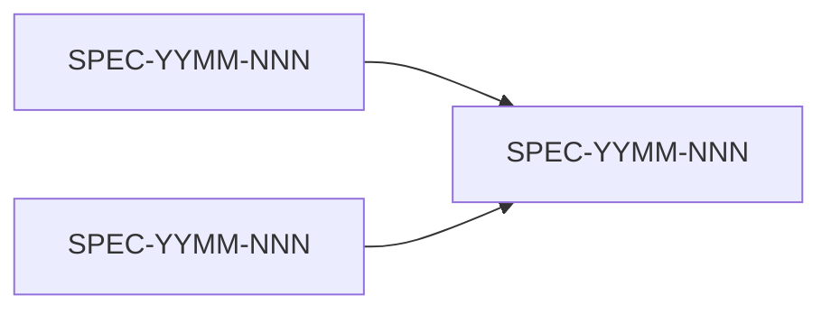

# Project Report

**Generated**: [YYYY-MM-DD HH:MM UTC]
**Project**: [Project name]

---

## Project Overview

[Summary from charter — project purpose, client, key outcomes. 2-3 sentences.]

---

## Architecture Summary

[Summary from .architecture/ index — solution approach, key technology decisions. 2-3 sentences.]

---

## Spec Pipeline by Status

| Status | Count | Specs |
|--------|-------|-------|
| Complete | [N] | [List of spec IDs] |
| In Development | [N] | [List] |
| Ready | [N] | [List] |
| Planning | [N] | [List] |
| Defining | [N] | [List] |
| Drafted | [N] | [List] |
| Blocked | [N] | [List] |

---

## Outcome Metrics

**Latest metrics report**: [Path to latest metrics report, or "Not generated"]

| Metric | Status | Value | Confidence | Notes |
|--------|--------|-------|------------|-------|
| Cycle Time | [measured/estimated/unavailable/not_applicable] | [Value] | [Confidence] | [Notes] |
| Delivery Predictability | [Status] | [Value] | [Confidence] | [Notes] |
| PR Acceptance on First Review | [Status] | [Value] | [Confidence] | [Notes] |
| Defect Escape Rate | [Status] | [Value] | [Confidence] | [Notes] |
| Rework Rate | [Status] | [Value] | [Confidence] | [Notes] |
| Spec Adherence Rate | [Status] | [Value] | [Confidence] | [Notes] |
| Traceability Coverage | [Status] | [Value] | [Confidence] | [Notes] |
| Cost per Delivered Feature | [Status] | [Value] | [Confidence] | [Notes] |

**Major data gaps**: [List the highest-priority gaps, or "None identified"]

---

## Detailed Spec Status

### [SPEC-YYMM-NNN: Name]

| Field | Value |
|-------|-------|
| **Status** | [Pipeline status] |
| **Owner** | [Owner] |
| **Priority** | [P1/P2/P3] |
| **Effort** | [S/M/L/XL] |
| **Phase** | [Project phase] |
| **Progress** | [done/total tasks (N%)] |
| **Last Activity** | [Date — Author] |
| **Branch** | [Branch name] |
| **PR** | [PR status if any] |
| **Artifacts** | [List of existing artifacts: spec.md, design.md, etc.] |

**Sub-specs**: [List with rollup status, or "None"]

**Warnings**: [Any warnings — stale, unassigned, unapproved implementation]

---

## Team Activity

| Contributor | Active Specs | Tasks Completed (30d) | Last Active |
|------------|-------------|----------------------|-------------|
| [Name] | [Spec list] | [N] | [Date] |

---

## Unassigned Specs

Specs needing an owner:

| Spec | Status | Priority | Effort |
|------|--------|----------|--------|
| [SPEC-YYMM-NNN: Name] | [Status] | [Priority] | [Effort] |

---

## Dependency Graph

---

## Health Indicators

| Indicator | Status | Details |
|-----------|--------|---------|
| **Unapproved implementations** | [N found / None] | [Specs with code but unmerged spec.md] |
| **Stale specs** | [N found / None] | [Specs with no activity in 14+ days] |
| **Blocked specs** | [N found / None] | [Specs blocked by dependencies or decisions] |
| **Unassigned specs** | [N found / None] | [Active specs without an owner] |
| **Overall progress** | [N%] | [done/total tasks across all specs] |
