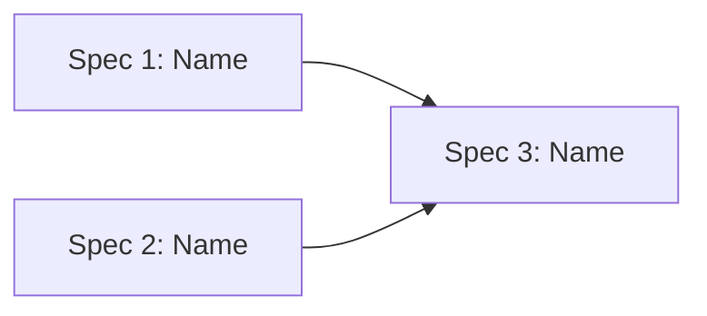

# Proposal

| Field | Value |
|-------|-------|
| **Client** | [Client name] |
| **Date** | [YYYY-MM-DD] |
| **Version** | 1.0 |
| **Status** | Draft |
| **What We Heard** | [Link to what-we-heard.md] |
| **Entry Point** | [RFI / RFP / Proposal / Draft SOW / Informal scoping / Mixed] |
| **Engagement Funding** | [Customer-funded / Microsoft-funded / Microsoft-program-funded / Unknown] |
| **SOW Agreement Family** | [End Customer Investment Funds (ECIF) / Client / Unknown] |
| **Commercial Model Signal** | [FFP / Outcome-driven / Managed capacity / Time and materials / Unknown] |
| **Page Limit** | [Stated page limit from solicitation, or "None stated"] |
| **Win Themes Defined** | [Yes (count) / No] |

---

## Proposal Outline

*Include this section when a proposal outline was generated and confirmed during outline review. This records the structural decisions that drove content generation. If no outline review was performed (no evaluation factors in source material), omit this section.*

| Section | Eval Factor(s) | Page Budget | Rationale |
|---------|----------------|-------------|-----------|
| [Section title] | [EF-IDs, comma-separated] | [Pages or words, if page limit exists] | [Why this factor maps here] |

*Outline confirmed by: [Human reviewer] on [date]. Source: [Generated draft / Pre-built file / Human-provided]*

---

## Executive Summary

[1-2 paragraphs. What we're proposing, why it works for this client, and the high-level approach. Written for executive audience. If win themes are defined, introduce them here as the foundation of the AIS value proposition.]

---

## Evaluation Response Matrix

*Include this section when the solicitation contains evaluation criteria or factors. Place it immediately after the Executive Summary so evaluators can quickly confirm coverage. If no evaluation factors exist, omit this section.*

| EF-ID | Evaluation Factor | Proposal Section(s) | Status | Evidence Summary |
|-------|-------------------|---------------------|--------|------------------|
| EF-001 | [Abbreviated factor text] | [Section reference(s)] | Exceeds / Meets / Partially Addressed / Not Addressed | [One-sentence summary of how AIS addresses this factor] |
| EF-002 | [Factor text] | | | |

*Status definitions: **Exceeds** — response goes beyond requirement. **Meets** — response fully addresses requirement. **Partially addressed** — response covers some aspects; gaps noted. **Not addressed** — factor not covered (justification required).*

---

## Win Themes

*Include this section when win themes have been defined. If no win themes were defined during outline review, note "No win themes defined for this proposal" and omit the table.*

Win themes are recurring motifs that differentiate AIS throughout this proposal.

| # | Customer Need | AIS Benefit | Differentiator |
|---|---------------|-------------|----------------|
| 1 | [What problem or hot button this addresses] | [What value AIS delivers] | [What makes AIS uniquely positioned] |
| 2 | [Need] | [Benefit] | [Differentiator] |

*These themes are referenced throughout the Proposed Approach, per-spec descriptions, and Evaluation Response Matrix.*

---

## Understanding

[Brief restatement of the business problem and desired outcomes. References what-we-heard.md for detail — does not duplicate it.]

---

## Proposed Approach

### Solution Overview

[2-3 paragraphs describing the overall solution approach. What are we building? How does it address the client's needs? What makes this approach appropriate?]

### Playbook Alignment

[Which playbook(s) inform this approach and why. Reference `.specify/playbooks/` entries.]

### Artifact Boundary

| Artifact | Planning Content | Confidence / Commitment |
|----------|------------------|-------------------------|
| RFI | [Eligibility, fit, response requirements, early gaps] | [Informational / TBD] |
| RFP | [Proposed scope, response requirements, evaluation criteria] | [Client request, not AIS commitment] |
| Proposal | [Recommended approach, proposed specs, ROM, assumptions, staffing inputs] | [Indicative until accepted into SOW] |
| SOW | [Contractual deliverables, acceptance criteria, period of performance, MSA alignment] | [Commitment only after signature] |

---

## Proposed Specs

Preliminary scope components that will become formal delivery specs. Each proposed spec maps to a coherent, deliverable capability.

| # | Name | Description | Effort | Phase |
|---|------|-------------|--------|-------|
| 1 | [Name] | [What this delivers] | S / M / L / XL | 1 |
| 2 | [Name] | [Description] | | |
| 3 | [Name] | [Description] | | |

### Dependency Sketch

---

## Phasing

| Phase | Goal | Proposed Specs | Duration |
|-------|------|-----------|----------|
| 1 — Foundation | [What Phase 1 achieves] | [Spec names] | [From source docs or TBD] |
| 2 — Full Capability | [What Phase 2 achieves] | [Spec names] | [From source docs or TBD] |

*Phasing describes elapsed delivery shape. Staffing and hours are modeled separately in the green-sheet inputs.*

---

## Technology Approach

| Layer | Recommendation | Rationale |
|-------|---------------|-----------|
| [Platform / Cloud] | [Choice] | [Why this fits] |
| [Backend / Framework] | [Choice] | [Why] |
| [Data / Storage] | [Choice] | [Why] |
| [AI / ML] | [Choice if applicable] | [Why] |
| [Frontend / UI] | [Choice] | [Why] |

---

## Assumptions

- [Key assumption about scope, technology, or constraints]
- [Assumption about client responsibilities]
- [Assumption about environment or access]
- [Assumption about client AI/coding-agent policy or delivery tooling]
- [Assumption about whether a customer cost model is in scope]

---

## Risks

| ID | Risk | Likelihood | Impact | Mitigation |
|----|------|-----------|--------|------------|
| R-001 | [Risk description] | Low / Medium / High | Low / Medium / High | [Mitigation approach] |
| R-002 | [Risk] | | | |

---

## Compliance Check

| Requirement / Clause | Source | Proposed Response / Evidence | Status | Impact |
|----------------------|--------|------------------------------|--------|--------|
| [Compliance requirement] | [RFI/RFP/SOW section] | [How AIS will respond or what evidence is needed] | Compliant / Partial / Gap / N/A / Needs confirmation | [Eligibility, scope, staffing, cost, timeline, acceptance] |

---

## SOW Readiness Inputs

Inputs that must be confirmed before proposal content can become a draft SOW.

| Readiness Item | Source / Owner | Status | Impact if Missing |
|----------------|----------------|--------|-------------------|
| MSA or master contract available for review | [Source / owner] | Available / Missing / N/A | [Warranty, acceptance, IP, quality, or legal-term mismatch] |
| Acceptance period and process known | [Source / owner] | Known / TBD | [Client acceptance window and delivery closeout] |
| Warranty/support window known | [Source / owner] | Known / TBD | [Team availability and contract execution window] |
| Non-negotiable milestones or funding dates known | [Source / owner] | Known / TBD | [Schedule and period of performance] |
| SOW agreement family and commercial model classified | [Source / owner] | Known / TBD | [Template selection and acceptance structure] |
| Commercial review path identified | [Business owner] | Known / TBD | [External pricing and terms review] |

---

## Clarifying Questions

### QA — Questions We Can Answer (with assumptions)

| # | Question | Our Assumption | Confidence | Impact if Wrong |
|---|----------|---------------|------------|-----------------|
| 1 | [Question] | [What we assume] | High / Medium / Low | [What changes if wrong] |

### QC — Questions for the Client

| # | Question | What It Blocks | Options |
|---|----------|---------------|---------|
| 1 | [Question needing client input] | [What can't proceed without this] | [Choices if applicable] |

---

## ROM

[Rough order of magnitude estimate if enough information is available. Otherwise, state what's needed to provide one.]

| Proposed Spec | Effort | Hours Range | Playbook Drivers | Confidence |
|---------------|--------|-------------|------------------|------------|
| [Spec name] | M | [Range] | [Questions/drivers/assumptions] | Medium |
| [Spec name] | L | [Range] | [Drivers] | Low |
| **Total** | | **[Range]** | | |

*ROM is indicative and subject to refinement during SOW scoping.*

---

## Staffing and Cost-Model Inputs

### Staffing Inputs

| Role | Responsibility | Allocation | Weeks / Phase | Weekly Hours | Total Hours | Source / Confidence |
|------|----------------|------------|---------------|--------------|-------------|---------------------|
| [Role] | [What they do] | [100% / 50% / 20% / 10% / Unknown] | [Weeks or phase, or Unknown] | [40 / 20 / 8 / 4 / Unknown] | [Hours or Unknown] | [Playbook / source / assumption] |

### External Cost-Model Inputs

| Cost Category | Assumption | Source | Owner | Status |
|---------------|------------|--------|-------|--------|
| Azure/platform consumption | [Usage basis or TBD] | [Source] | [AIS / Client] | Known / Needs model / Missing |
| Language-model/token usage | [Hosted model, usage basis, chargeback path, or TBD] | [Source] | [AIS / Client] | Known / Needs model / Missing |
| Third-party services | [Licenses, data, monitoring, evals, etc.] | [Source] | [AIS / Client] | Known / Needs model / Missing |
| Customer operating cost model | [Whether AIS should help produce one] | [Source] | [AIS / Client] | In scope / Out of scope / TBD |

*AIS-spec artifacts capture staffing hours, allocation, and cost-model inputs only. Rates, pricing, profitability, and final commercial terms stay in external business review artifacts.*

---

## Information Gaps

| Gap | What It Blocks | Resolves With |
|-----|---------------|---------------|
| [Missing information] | [Which specs or estimates are affected] | [How to resolve — client meeting, document, decision] |

---

## Next Steps

- [ ] Client reviews proposal and provides feedback
- [ ] Resolve QC questions
- [ ] Validate QA assumptions
- [ ] If aligned, proceed to SOW scoping (`/ais.presales.scope`)
