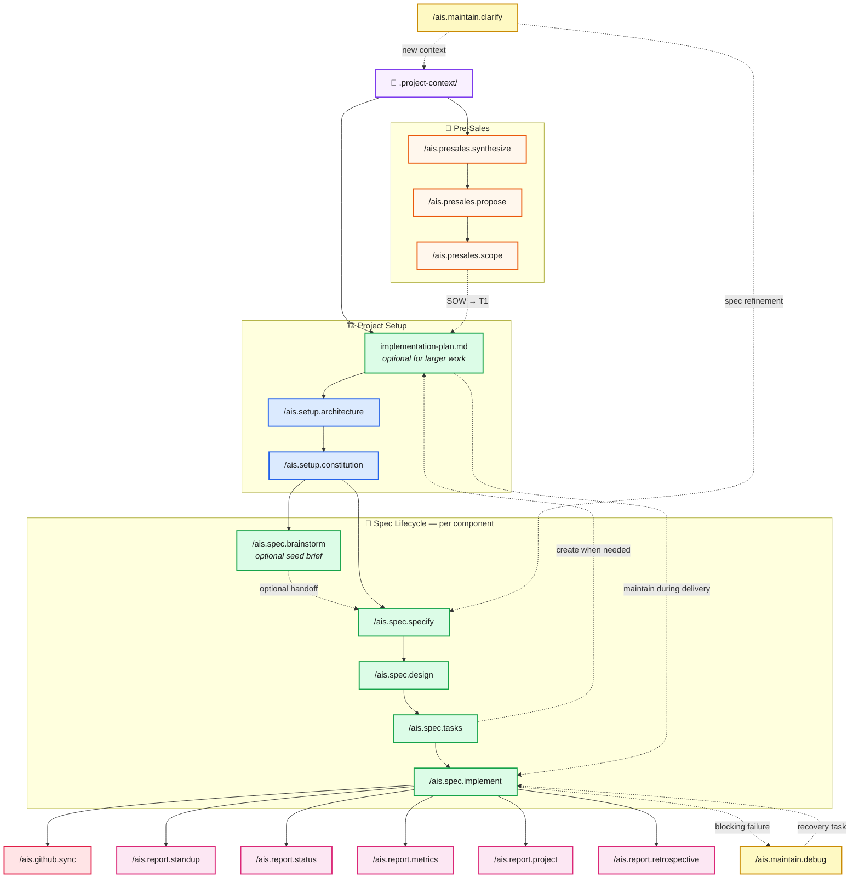

# AIS: Spec-Driven Development

[](https://github.com/ais-internal/AIS-spec/actions/workflows/ci.yml)

AI coding tools are fast but directionless. Without structure, they generate
code that drifts from requirements, contradicts itself across components, and
creates rework. This framework gives AI agents a spec-driven workflow —
requirements in, working software out — so every line of generated code traces
back to a decision someone actually made.

It covers the full project lifecycle: scope and estimate during pre-sales,
decompose into architecture and specs, then build component-by-component with
full traceability. Works with Claude Code, GitHub Copilot, Cursor, and Codex.

## Getting Started

### Prerequisites

- **[Git](https://git-scm.com/)** — for branching and version control
- **AI coding tool** — any of the following:
  - [Claude Code](https://docs.anthropic.com/en/docs/claude-code) — `/ais.*` slash commands
  - [GitHub Copilot](https://github.com/features/copilot) — custom agents in `.github/agents/`
  - [Cursor](https://www.cursor.com/) — `/ais.*` slash commands (Skills)
  - [Codex](https://developers.openai.com/codex/overview) — `AGENTS.md` + `.agents/skills/` skills
> Commands and repo instructions are generated from shared prompts in `.specify/prompts/`.
> See **[docs/reference/multi-tool-commands.md](docs/reference/multi-tool-commands.md)** for the editing workflow.

### Try It

1. Clone this repo
2. Open it in your AI coding tool (Claude Code, Copilot, Cursor, or Codex)
3. Run a demo:
   - **[Hello World](docs/getting-started/hello-world/)** — Build a Pomodoro timer in 7 commands
   - **[Pre-Sales Demo](docs/getting-started/pre-sales-demo/)** — Scope an AI project from RFP to SOW

For real projects, create a repo in your project's GitHub org (not here) and
copy the framework files over. See the
**[project setup guide](docs/guides/project-setup.md)**. Existing projects can
use the **[upgrade guide](docs/guides/upgrade.md)** to move between framework
versions safely.

> See **[CONTRIBUTING.md](CONTRIBUTING.md)** for branching conventions and PR process.

## Commands

> **[Full command reference →](docs/reference/commands.md)** — modes, flags, input
> requirements, and detailed behavior for every command.

### Pre-Sales (scope and estimate)

| Command | What it does |
|---------|-------------|
| `/ais.presales.synthesize` | Synthesize client inputs into a What We Heard document |
| `/ais.presales.propose` | Generate proposal with proposed specs, phasing, and ROM |
| `/ais.presales.scope` | Produce SOW with deliverables and delivery bridge |

### Setup (run once per project)

| Command | What it does |
|---------|-------------|
| `/ais.setup.plan` | Read `.project-context/` and produce a project plan with SPEC catalog |
| `/ais.setup.architecture` | Synthesize solution architecture with C4 diagrams and constitution seed |
| `/ais.setup.constitution` | Create or amend the project constitution (governance, standards, gates) |

### Spec Lifecycle (per component)

| Command | What it does |
|---------|-------------|
| `/ais.spec.brainstorm` | Optionally shape an early idea into a Spec Seed Brief before specification |
| `/ais.spec.specify` | Create feature spec with YYMM-NNN versioning; handles sub-specs |
| `/ais.spec.design` | Research, data model, contracts, and technical decisions |
| `/ais.spec.tasks` | Generate dependency-ordered tasks, with `implementation-plan.md` for larger or riskier work |
| `/ais.spec.implement` | Execute tasks phase-by-phase with review/evidence gates and keep `implementation-plan.md` current when present |
| `/ais.github.sync` | Bidirectional sync with GitHub (milestones, issues, labels) |

### Reporting (derived from repo state)

| Command | What it does |
|---------|-------------|
| `/ais.report.standup` | Internal daily report — active work, blockers, stale specs |
| `/ais.report.status` | Client-facing status report — progress, decisions, risks |
| `/ais.report.project` | Comprehensive report — pipeline, team activity, dependency graph |
| `/ais.report.metrics` | Outcome metrics report — speed, quality, traceability, economics |
| `/ais.report.retrospective` | Internal retrospective — start/stop/continue adoption and process improvements |

**GitHub Actions**: Reports can run automatically via workflows in `.github/workflows/`.
See [Automated Reports](#automated-reports) for setup.

### Maintain (ongoing)

| Command | What it does |
|---------|-------------|
| `/ais.maintain.clarify` | Smart router: ingest project context OR clarify spec ambiguities |
| `/ais.maintain.debug` | Diagnose implementation, test, build, integration, or runtime failures before fixing |

> **Status tracking is automatic.** Each spec lifecycle command updates
> the spec.md frontmatter status. Report commands derive live state from
> the repo. No manual status updates needed.
>
> **Alignment stays visible.** The project charter and each spec start with a
> short Alignment Brief — objective, users/actors, scenarios, and guiding
> principles — so planning and review conversations can re-anchor quickly.

## Workflow

> **[Full workflow diagram →](docs/reference/workflow.md)**



Status updates happen automatically via spec.md frontmatter.
Each step: defining → planning → ready → in-dev → complete

## Spec Versioning

Specs use **YYMM-NNN** IDs based on creation date:

```
specs/
  .presales/                        Pre-sales artifacts (what-we-heard, proposal, SOW)
  .project-plan/                    Project plan (folder)
  .architecture/                    Solution architecture (folder)

  2602-001-user-auth/               Feb 2026, first spec
    spec.md
    design.md
    implementation-plan.md
    tasks.md
  2602-001.1-oauth-flow/            Sub-spec of 2602-001
    spec.md
  2602-002-dashboard/               Feb 2026, second spec
    spec.md
  2603-001-reporting/               Mar 2026, first spec
    spec.md
```

**Sub-specs** use dot notation: `2602-001.1`, `2602-001.2`
**Branches** match the spec ID: `2602-001-user-auth`

## Smart Clarify

`/ais.maintain.clarify` detects context automatically:

- **Provide source material** (file, directory, description) → project-level ingestion
- **On a feature branch** → spec-level ambiguity resolution
  - Unimplemented tasks → updates spec in place
  - Implemented tasks → suggests new spec

## File Layout

> See **[CONTRIBUTING.md](CONTRIBUTING.md)** for the full project directory
> structure including `source/`, `infra/`, `tests/`, and `.github/workflows/`.

```
project-root/
  README.md                         This file
  PLANS.md                         Rules for implementation-plan.md
  CONTRIBUTING.md                   Contributor operating model
  .project-context/                 Raw project inputs (gitignored)
    .archive/                       Processed files moved here
  .specify/
    repo-instructions.md            Shared repo-level instructions (source of truth)
    prompts/                        Shared command prompts (source of truth)
    playbooks/                      Domain-specific engagement playbooks
    memory/
      constitution.md               Project-wide governance
    templates/                      Output templates
    scripts/bash/                   Automation scripts (return JSON)
  .claude/commands/                 Generated — Claude Code slash commands
  .agents/skills/                   Generated — Codex Skills ($ais.* and /skills)
  .github/agents/                   Generated — Copilot custom agents (@ais-*)
  .cursor/skills/                    Generated — Cursor Skills (/ais.* commands)
  docs/
    getting-started/                Demos and quick-start guides
    reference/                      Command reference, workflow, multi-tool
    guides/                         Setup, upgrade, pre-sales, delivery, roles, process mapping
  specs/
    .presales/                      Pre-sales artifacts (from /ais.presales.*)
    .project-plan/                  Project plan (from /ais.setup.plan)
    .architecture/                  Solution architecture (from /ais.setup.architecture)
    YYMM-NNN-feature/               Per-component specs
      spec.md
      design.md
      implementation-plan.md
      tasks.md
      research.md
      data-model.md
      contracts/
      quickstart.md
      checklists/
      .github-sync.json            GitHub sync metadata
```

## Automated Reports

GitHub Actions workflows generate reports on demand or on a schedule. They use
Claude Code via [Azure AI Foundry](https://ai.azure.com/) and commit reports
to `specs/.project-plan/reports/`.

| Workflow | Trigger | What it runs |
|----------|---------|-------------|
| Report: Daily Standup | Weekdays 9 AM UTC + manual | `/ais.report.standup` |
| Report: Client Status | Manual | `/ais.report.status` |
| Report: Project Overview | Manual | `/ais.report.project` |
| Report: Outcome Metrics | Manual | `/ais.report.metrics` |
| Report: Project Retrospective | Manual | `/ais.report.retrospective` |
| Report: All Reports | Manual | All five sequentially |

### Setup

Add three secrets to your GitHub repo (Settings > Secrets and variables > Actions):

| Secret | Description |
|--------|-------------|
| `ANTHROPIC_FOUNDRY_API_KEY` | API key for your Azure AI Foundry deployment |
| `ANTHROPIC_FOUNDRY_BASE_URL` | Foundry endpoint URL (e.g. `https://<resource>.services.ai.azure.com/anthropic`) |
| `CLAUDE_MODEL` | Deployed model name (e.g. `claude-sonnet-4-5`) |

Once configured, trigger any report from the Actions tab or let the standup
run on its daily schedule.
