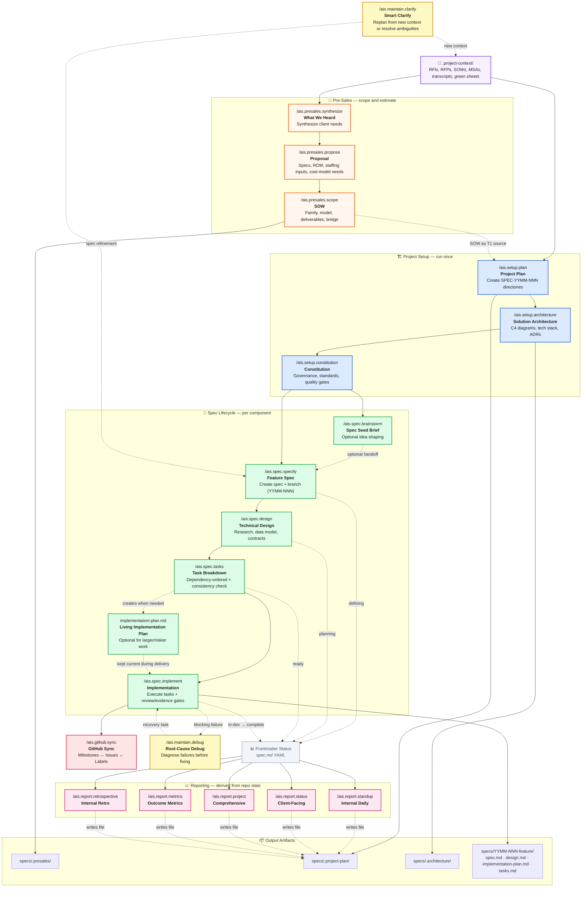

# AIS Workflow



## Phases at a Glance

| Phase | Commands | Key Output |
|-------|----------|------------|
| **Pre-Sales** | `synthesize` -> `propose` -> `scope` | 01-what-we-heard, 02-proposal with proposed specs/ROM/staffing inputs, 03-sow with SOW family/model and readiness |
| **Setup** | `plan` → `architecture` → `constitution` | Project plan, C4 architecture, governance standards |
| **Spec Lifecycle** | optional `brainstorm` → `specify` → `design` → `tasks` → `implement` | Optional seed brief, feature spec, technical design, optional implementation plan, task list, working code |
| **Reporting** | `standup` · `status` · `project` · `metrics` · `retrospective` | Persisted reports in `specs/.project-plan/reports/` |
| **Sync** | `github.sync` | GitHub milestones, issues, and labels |
| **Maintain** | `clarify` · `debug` | Replanned context, refined specs, or failure diagnosis |

## Status Progression

Each spec lifecycle command updates the `status` field in spec.md frontmatter:

```
defining  →  planning  →  ready  →  in-dev  →  complete
```

Report commands derive live pipeline status from both frontmatter and git state.
